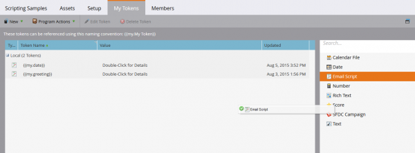

# E-postskript

Obs! Vi rekommenderar att du läser [Användarhandbok för snabbhet](https://velocity.apache.org/engine/devel/user-guide.html) för att få en djupdykning i hur språket i snabbhetsmallen fungerar.

[Apache-hastighet](https://velocity.apache.org/) är ett språk som bygger på Java och som är utformat för att malla och skripta HTML. Marketo tillåter att den används i e-postsammanhang med hjälp av skripttokens. Detta ger åtkomst till data som lagras i säljprojekt och anpassade objekt och gör det möjligt att skapa dynamiskt innehåll i e-postmeddelanden. Hastigheten ger ett högnivåkontrollflöde med if/else, for, and for each som tillåter villkorsstyrd och iterativ manipulering av innehåll. Här är ett enkelt exempel på hur du skriver ut en hälsningsfras:

```java
//check if the lead is male
if(${lead.MarketoSocialGender} == "Male")
    if the lead is male, use the salutation 'Mr.'
    set($greeting = "Dear Mr. ${lead.LastName},")
//check is the lead is female
elseif(${lead.MarketoSocialGender} == "Female")
    if female, use the salutation 'Ms.'
    set($greeting = "Dear Ms. ${lead.LastName},")
else
    //otherwise, use the first name
    set($greeting = "Dear ${lead.FirstName},")
end
print the greeting and some content
${greeting}

    Lorem ipsum dolor sit amet...
```

## Variabel

Variabler har alltid prefixet &#39;$&#39; och ställs in och uppdateras med #set:

```
#set($variable = "value")
```

Deras värden kan sedan hämtas via flera olika referenstyper med olika beteenden:

```
$variable ##outputs 'value'
$variablename ##outputs '$variablename'
${variable}name ##outputs 'valuename'
```

Det finns också en tyst referensnotation, där det finns en `!` Ingår efter `$`. När hastigheten påträffar en odefinierad referens lämnas strängen som representerar referensen på plats. Om en odefinierad referens påträffas med tyst referensnotation genereras inget värde:

```
##Defined Reference

#set($foo = "bar")
$foo ##outputs "bar"

##Undefined Reference

##normal
$baz ##outputs "$baz"

##quiet
$!baz ##outputs nothing
```

Mer information om hur du refererar till variabler finns i [Användarhandbok för Apache](https://velocity.apache.org/engine/devel/user-guide.html#formal-reference-notation).

## Snabbhetsverktyg

Med snabbprojektet Apache blir funktionaliteten tillgänglig genom användning av [Snabbhetsverktyg](https://velocity.apache.org/tools/devel/apidocs/overview-summary.html). Dessa är helt enkelt wrappers för Java-objekt och visar deras metoder med globala variabler som är tillgängliga för alla skript.

- [AlternatorTool](https://velocity.apache.org/tools/devel/apidocs/org/apache/velocity/tools/generic/AlternatorTool.html)
- [ComparisonDateTool](https://velocity.apache.org/tools/devel/apidocs/org/apache/velocity/tools/generic/ComparisonDateTool.html)
- [Konverteringsverktyg](https://velocity.apache.org/tools/devel/apidocs/org/apache/velocity/tools/generic/ConversionTool.html)
- [DateTool](https://velocity.apache.org/tools/devel/apidocs/org/apache/velocity/tools/generic/DateTool.html)
- [DisplayTool](https://velocity.apache.org/tools/devel/apidocs/org/apache/velocity/tools/generic/DisplayTool.html)
- [MathTool](https://velocity.apache.org/tools/devel/apidocs/org/apache/velocity/tools/generic/MathTool.html)
- [NumberTool](https://velocity.apache.org/tools/devel/apidocs/org/apache/velocity/tools/generic/NumberTool.html)
- [EscapeTool](https://velocity.apache.org/tools/devel/apidocs/org/apache/velocity/tools/generic/EscapeTool.html)
- [LoopTool](https://velocity.apache.org/tools/devel/apidocs/org/apache/velocity/tools/generic/LoopTool.html)

Om du till exempel vill använda en metod från `ComparisonDateTool`, få åtkomst om från `$date` variabel i en skripttoken:

```
#set($birthday = $convert.parseDate("2015-08-07","yyyy-MM-dd"))
##use whenIs to determine how many days away it is
$date.whenIs($birthday).days ##outputs 1
```

## Skapa en skripttoken

Snabbhetsskript inkluderas i e-postmeddelanden med hjälp av e-postskripttoken. Dessa kan skapas i marknadsföringsaktiviteter i antingen en marknadsföringsmapp eller ett program. För att en token ska kunna användas i ett e-postmeddelande måste e-postmeddelandet vara underordnat ett program som antingen äger token eller ärver den från en marknadsföringsmapp. Om du vill skapa en token går du till en mapp eller ett program och väljer [!UICONTROL My Tokens] -fliken. Dra alternativet E-postskript från den högra menyn till tokenlistan



Här kan du redigera namnet på variabeln och öppna redigeraren via alternativet Klicka för att redigera:


När du är i redigeraren kan du skapa ett skript med åtkomst till alla variabler i skripttillgängliga objekt. Om du vill hämta en fältreferens från ett objekt drar du den från det högra trädet till skriptet:


## Inbäddning och testning av skript

När du har definierat skriptet i en Program My Token kan du referera till det i ett visst e-postmeddelande med hjälp av Marketo e-postredigerare.


Du kan testa skriptet med e-poståtgärden&quot;Skicka exempel på e-post&quot; i Marketo e-postdesigner. För att skriptet ska kunna behandlas på rätt sätt måste du välja ett befintligt lead som personifieras i fältet Lead. Om du testar med `$TriggerObject`kan du välja utlösarobjektet via parametern Trigger. Detta använder data från det senast uppdaterade objektet av den typen som `$TriggerObject` variabel.


Du kan också använda e-postförhandsvisningen för att testa skriptet. Om du vill göra det måste du välja Visa som: Leaddetalj och välja en lead från en tillgänglig statisk lista. Detta medför även en fördel med att skriva ut eventuella undantag som kan ha inträffat under skriptkörningen:


## Användbara tips

Den sammanlagda längden för alla e-postskripttoken i ett visst e-postmeddelande får inte överstiga 100 000 byte. Den här gränsen gäller den totala längden för själva tokensträngarna (inte den totala längden efter att tokens har utökats).

- Variablerna som refereras i e-postskriptet måste finnas i Marketo på ett av de objekt som är tillgängliga för skriptet.
- Du kan referera till anpassade objekt på första och andra nivån som härstammar från det inbyggda integrerade CRM-systemet och som är direkt kopplade till lead- eller kontaktpersonen, men inte till anpassade objekt på tredje nivån. Anpassade objekt får inte vara överordnade leads eller företag
- För anpassade Marketo-objekt kan du referera till anpassade objekt på andra nivån med en överordnad-underordnad relation. Till exempel `Lead <- Parent <- Child`. Du kan inte referera till anpassade objekt på andra nivån med Edge-Bridge-relationen. exempelvis,  `Lead <- Bridge -> Edge`
- Du kan referera till anpassade objekt som är kopplade till ett lead, en kontakt eller ett konto, men inte till fler än ett.
- Anpassade objekt kan bara refereras via en enda anslutning, lead, kontakt eller konto
- Du måste markera kryssrutan i skriptredigeraren för de fält som du använder, annars kommer de inte att bearbeta
- För varje anpassat objekt är de tio senast uppdaterade posterna per person/kontakt tillgängliga vid körning och beställs från den senaste uppdateringen (0) till den äldsta (9). Du kan öka antalet poster som är tillgängliga av [följa instruktionerna](https://experienceleague.adobe.com/en/docs/marketo/using/product-docs/administration/email-setup/change-custom-object-retrieval-limits-in-velocity-scripting).
- Om du inkluderar mer än ett e-postskript i ett e-postmeddelande körs de uppifrån och ned. Variabelomfånget som definieras i det första skriptet som ska köras är tillgängligt i efterföljande skript.
- Systemreferens: [https://velocity.apache.org/tools/2.0/index.html](https://velocity.apache.org/tools/2.0/index.html)
- En anteckning om variabler som innehåller radmatningstecken &quot;\\n&quot; eller &quot;\\r\\n&quot;. När ett e-postmeddelande skickas via Skicka exempel eller via en gruppkampanj ersätts radmatningstecken med blanksteg. När e-post skickas via Trigger Campaign lämnas radmatningstecken orörda.
- För att URL-adresserna ska kunna tolkas korrekt bör hela sökvägen anges som en variabel och sedan skrivas ut, och variabeln får inte skrivas ut i URL-referenser. Protokollet (http:// eller https://) måste inkluderas och måste vara separat från resten av URL:en. URL:en måste också vara en del av ett helt format ankare (<a>). Skriptet måste skriva ut en fullt formaterad ankartagg för att länkarna ska kunna spåras. Länkar spåras inte om de skrivs ut från en for- eller foreach-slinga.

```html
<!-- Correct -->
#set($url = "www.example.com/${object.id}")
<a href="http://${url}">Link Text</a>

<!-- Correct -->
<a href="http://www.example.com/${object.id}">Link Text</a>

<!-- Incorrect -->
<a href="${url}">Link Text</a>

<!-- Incorrect -->
<a href="{{my.link}}">Link Text</a>

<!-- Incorrect -->
<a href="http://{{my.link}}">Link Text</a>
```
