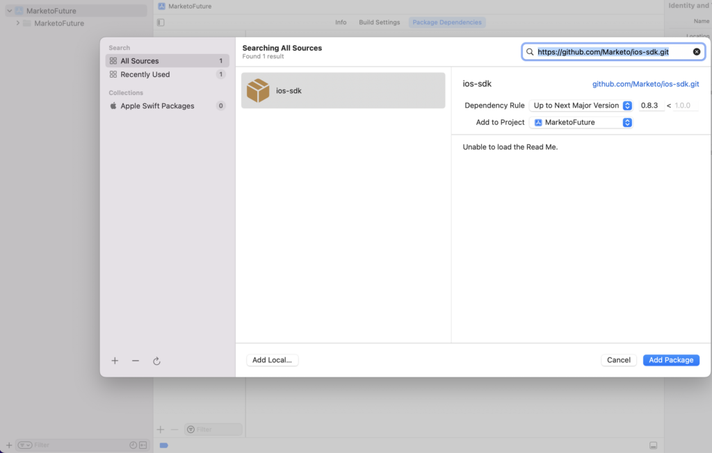

# Installation

Installationsanvisningar för Marketo Mobile SDK. Stegen nedan krävs för att skicka push-meddelanden och/eller meddelanden i appen.

## Installera Marketo SDK på iOS

### Förutsättningar

1. [Lägga till ett program i Marketo Admin](https://experienceleague.adobe.com/en/docs/marketo/using/product-docs/mobile-marketing/admin/add-a-mobile-app) (hämta programmets hemliga nyckel och Munchkin-ID)
1. [Konfigurera push-meddelanden](push-notifications.md) (valfritt)

### Installera Framework via CocoaPods

1. Installera CocoaPods. `$ sudo gem install cocoapods`
1. Byt katalog till din projektkatalog och skapa en Podfile med smarta standardinställningar. `$ pod init`
1. Öppna din Podfile. `$ open -a Xcode Podfile`
1. Lägg till följande rad i din Podfile. `$ pod 'Marketo-iOS-SDK'`
1. Spara och stäng din Podfile.
1. Hämta och installera Marketo iOS SDK. `$ pod install`
1. Öppna arbetsytan i Xcode. `$ open App.xcworkspace`

### Installera ramverk med Swift Package Manager

1. Välj projektet i projektnavigeraren och klicka på + under Lägg till paketberoende enligt nedan:

   

1. Lägg till Marketo-paket från denna repo. Lägg till den här URL:en för den här databasen: https://github.com/Marketo/ios-sdk.

   

1. Lägg nu till resurspaketet enligt följande: Sök `MarketoFramework.XCframework` i projektnavigeraren och öppna den i Finder. Dra och släpp `MKTResources.bundle` för att kopiera källmaterial.

### Ställ in Swift Bridging Header

1. Gå till Arkiv > Nytt > Arkiv och välj &quot;Huvudfil&quot;.

   

1. Namnge filen &quot;&lt;_ProjectName_>-Bridging-Header&quot;.

1. Gå till Project > Target > Build Phases > Swift Compiler > Code Generation. Lägg till följande sökväg till Objective-Bridging Header:

   `$(PODS_ROOT)/<_ProjectName_>-Bridging-Header.h`

   

## Initiera SDK

Innan du kan använda Marketo iOS SDK måste du initiera det med ditt konto-ID för Munchkin och App Secret Key. Var och en av dessa finns under&quot;Mobilappar och enheter&quot; i Marketo Admin.

1. Öppna filen AppDelegate.m (Objective-C) eller filen Bridging (Swift) och importera Marketo.h-huvudfilen.

   ```
   #import <MarketoFramework/MarketoFramework.h>
   ```

1. Klistra in följande kod i `application:didFinishLaunchingWithOptions`: function.

   Observera att vi måste skicka&quot;native&quot; som ramverkstyp för Native Apps.

>[!BEGINTABS]

>[!TAB Mål C]

```
Marketo *sharedInstance = [Marketo sharedInstance];

[sharedInstance initializeWithMunchkinID:@"munchkinAccountId" appSecret:@"secretKey" mobileFrameworkType:@"native" launchOptions:launchOptions];
```

>[!TAB Swift]

```
let sharedInstance: Marketo = Marketo.sharedInstance()

sharedInstance.initialize(withMunchkinID: "munchkinAccountId", appSecret: "secretKey", mobileFrameworkType: "native", launchOptions: launchOptions)
```

>[!ENDTABS]

1. Ersätt `munkinAccountId` och `secretKey` ovan med ditt konto-ID för Munchkin och Hemlig nyckel som finns i Marketo **[!UICONTROL Admin]** > **[!UICONTROL Mobile Apps and Devices]** -avsnitt.

## iOS Test Devices

1. Välj Projekt > Mål > Info > URL-typer.
1. Lägg till identifierare: ${PRODUCT_NAME}
1. Ange URL-scheman: `mkto-<Secret Key_>`
1. Inkludera program:openURL:sourceApplication:annotation: till filen AppDelegate.m (Objective-C)

## Hantera anpassad URL-typ i AppDelegate

>[!BEGINTABS]

>[!TAB Mål C]

```
- (BOOL)application:(UIApplication *)app
            openURL:(NSURL *)url
            options:(NSDictionary<UIApplicationOpenURLOptionsKey,id> *)options{
   
    return [[Marketo sharedInstance] application:app
                                         openURL:url
                                         options:options];    
}
```

>[!TAB Swift]

```
private func application(_ app: UIApplication, open url: URL, options: [UIApplication.OpenURLOptionsKey : Any] = [:]) -> Bool
    {
        return Marketo.sharedInstance().application(app, open: url, options: options)
    }
```

>[!ENDTABS]

## Installera Marketo SDK på Android

### Förutsättningar

1. [Lägga till ett program i Marketo Admin](https://experienceleague.adobe.com/en/docs/marketo/using/product-docs/mobile-marketing/admin/add-a-mobile-app) (hämta programmets hemliga nyckel och Munchkin-ID)
1. [Konfigurera push-meddelanden](push-notifications.md#android_setup_push) (valfritt)
1. [Hämta Marketo SDK för Android](https://codeload.github.com/Marketo/android-sdk/zip/refs/heads/master)

### Android SDK-inställningar med Gradle

1. Lägg till under avsnittet Beroenden i filen build.gradle på programnivå

`implementation 'com.marketo:MarketoSDK:0.8.9'`

1. Roten `build.gradle` filen ska ha

   ```
   buildscript {
       repositories {
           google()
           mavenCentral()
       }
   ```

1. Synkronisera projektet med grå filer

### Konfigurera behörigheter

Öppna `AndroidManifest.xml` och lägga till följande behörigheter. Ditt program måste begära behörigheterna INTERNET och ACCESS_NETWORK_STATE. Om appen redan begär dessa behörigheter hoppar du över det här steget.

```xml
<uses‐permission android:name="android.permission.INTERNET"></uses‐permission>
<uses‐permission android:name="android.permission.ACCESS_NETWORK_STATE"></uses‐permission>
```

### Initiera SDK

1. Öppna klassen Application eller Activity i din app och importera Marketo SDK till din Activity före setContentView eller i Application Context.

   ```java
   // Initialize Marketo
   Marketo marketoSdk = Marketo.getInstance(getApplicationContext());
   marketoSdk.initializeSDK("native","munchkinAccountId","secretKey");
   ```

1. ProGuard-konfiguration (valfritt)

   Om du använder ProGuard för din app lägger du till följande rader i din `proguard.cfg` -fil. Filen finns i projektmappen. Om du lägger till den här koden utesluts Marketo SDK från döljningsprocessen.

   ```
   -dontwarn com.marketo.*
   -dontnote com.marketo.*
   -keep class com.marketo.`{ *; }
   ```

## Android-testenheter

Lägg till MarketoActivity i `AndroidManifest.xml` -fil inuti programtagg.

```xml
<activity android:name="com.marketo.MarketoActivity"  android:configChanges="orientation|screenSize" >
    <intent-filter android:label="MarketoActivity" >
        <action  android:name="android.intent.action.VIEW"/>
        <category  android:name="android.intent.category.DEFAULT"/>
        <category  android:name="android.intent.category.BROWSABLE"/>
        <data android:host="add_test_device" android:scheme="mkto" />
    </intent-filter>
</activity>
```

## Stöd för Firebase Cloud Messaging

MME Software Development Kit (SDK) för Android har uppdaterats till ett modernare, stabilare och skalbart ramverk som innehåller mer flexibilitet och nya ingenjörsfunktioner för din Apputvecklare i Android.

Apputvecklare för Android kan nu använda Google direkt [Firebase Cloud Messaging](https://firebase.google.com/docs/cloud-messaging/) (FCM) med denna SDK.

### Lägga till FCM i ditt program

1. Integrera den senaste Marketo Android SDK i Android-appen.  Steg finns på [GitHub](https://github.com/Marketo/android-sdk).
1. Konfigurera Firebase-appen på Firebase Console.
   1. Skapa/lägg till ett projekt på [](https://accounts.google.com/ServiceLogin?passive=1209600&amp;osid=1&amp;continue=https://console.firebase.google.com/&amp;followup=https://console.firebase.google.com/)Firebase Console.
      1. I [Firebase-konsol](https://accounts.google.com/ServiceLogin?passive=1209600&amp;osid=1&amp;continue=https://console.firebase.google.com/&amp;followup=https://console.firebase.google.com/), markera `Add Project`.
      1. Välj GCM-projekt i listan över befintliga Google Cloud-projekt och välj `Add Firebase`.
      1. I Firebase-välkomstskärmen väljer du `Add Firebase to your Android App`.
      1. Ange ditt paketnamn och SHA-1, och välj `Add App`. En ny `google-services.json` filen för din Firebase-app hämtas.
      1. Välj `Continue` och följ instruktionerna för hur du lägger till Google Services-pluginprogrammet i Android Studio.

   1. Navigera till Projektinställningar i projektöversikten
      1. Klicka på fliken Allmänt. Hämta filen google-services.json.
      1. Klicka på fliken Cloud Messaging. Kopiera servernyckel och avsändar-ID. Ange dessa servernycklar och avsändar-ID till Marketo.
   1. Konfigurera FCM-ändringar i Android-appen
      1. Växla till projektvyn i Android Studio för att se projektets rotkatalog
         1. Flytta den hämtade Google-services.json-filen till rotkatalogen i Android-appmodulen
         1. Lägg till följande i build.gradle på projektnivå:

            ```
            buildscript {
              dependencies {
                classpath 'com.google.gms:google-services:4.0.0'
              }
            }
            ```

         1. Lägg till följande i build.gradle på appnivå:

            ```
            dependencies {
              compile 'com.google.firebase:firebase-core:17.4.0'
            } 
            // Add to the bottom of the file 
            apply plugin: 'com.google.gms.google-services'
            ```

         1. Klicka slutligen på Synkronisera nu i fältet som visas i ID:t
   1. Redigera appens manifest FCM SDK lägger automatiskt till alla nödvändiga behörigheter och den nödvändiga mottagarfunktionen. Se till att ta bort följande föråldrade (och potentiellt skadliga, eftersom de kan orsaka duplicering av meddelanden) element från appens manifest:

      ```xml
      <uses-permission android:name="android.permission.WAKE_LOCK" />
      <permission android:name="<your-package-name>.permission.C2D_MESSAGE" android:protectionLevel="signature" />
      <uses-permission android:name="<your-package-name>.permission.C2D_MESSAGE" />
      
      ...
      
      <receiver>
        android:name="com.google.android.gms.gcm.GcmReceiver"
        android:exported="true"
        android:permission="com.google.android.c2dm.permission.SEND"
        <intent-filter>
          <action android:name="com.google.android.c2dm.intent.RECEIVE" />
          <category android:name="<your-package-name> />
        </intent-filter> 
      </receiver>
      ```
