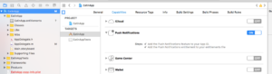

# Ionic

I det här avsnittet beskrivs hur du integrerar Marketo Cordova-pluginprogrammet. Kondensatorn [!DNL Ionic] stöds inte för närvarande.

## Förutsättningar

1. [Lägg till ett program i Marketo Admin](https://experienceleague.adobe.com/en/docs/marketo/using/product-docs/mobile-marketing/admin/add-a-mobile-app) (hämta programhemlig nyckel och Munchkin-ID).
1. Konfigurera push-meddelanden ([iOS](push-notifications.md)) | [Android](push-notifications.md) ).
1. Installera [[!DNL Ionic]](https://ionicframework.com/getting-started/) &amp; [Cordova CLI](https://cordova.apache.org/docs/en/latest/guide/cli/).

## Installationsanvisningar

### Konfigurera Marketo [!DNL Ionic]-plugin

1. Om Cordova CLI är installerat går du till programkatalogen [!DNL Ionic] och kör följande kommando för att lägga till Marketo-plugin-programmet i programmet:

   `$ ionic plugin add https://github.com/Marketo/PhoneGapPlugin.git --variable APPLICATION_SECRET_KEY="YOUR_APPLICATION_SECRET"`

1. Kör följande kommando för att bekräfta att plugin-programmet har lagts till i programmet:

   `$ ionic plugin list com.marketo.plugin 0.X.0 "MarketoPlugin"`

### Migrera till nyare version (valfritt)

1. Om du vill ta bort ett befintligt plugin-program kör du följande kommando:

   `$ ionic plugin remove com.marketo.plugin`

1. Om du vill läsa plugin-programmet kör du följande kommando:

   `$ ionic plugin add https://github.com/Marketo/PhoneGapPlugin.git --variable APPLICATION_SECRET_KEY="YOUR_APPLICATION_SECRET"`

### Aktivera push-meddelanden i xCode

1. Aktivera funktionen för push-meddelanden i xCode-projekt.

### Spåra push-meddelanden

Klistra in följande kod i funktionen `application:didFinishLaunchingWithOptions:`.

>[!BEGINTABS]

>[!TAB Mål C]

```
Marketo *sharedInstance = [Marketo sharedInstance];

[sharedInstance trackPushNotification:launchOptions];
```

>[!TAB Swift]

```
let sharedInstance: Marketo = Marketo.sharedInstance()

sharedInstance.trackPushNotfication(launchOptions)
```

>[!ENDTABS]

### Initiera Marketo Framework

Om du vill vara säker på att Marketo-ramverket initieras när appen startas lägger du till följande kod under funktionen `onDeviceReady` i JavaScript huvudfil.

Du måste skicka `ionicCordova` som ramverkstyp för [!DNL Ionic] Cordova-appar.

#### Syntax

```javascript
// This method will Initialize the Marketo Framework using Your MunchkinId and Secret Key
marketo.initialize(
  function() { console.log("MarketoSDK Init done."); },
  function(error) { console.log("an error occurred:" + error); },
  'YOUR_MUNCHKIN_ID',
  'YOUR_SECRET_KEY',
  'FRAMEWORK_TYPE'
);

// For session tracking, add following. 
marketo.onStart(
  function(){ console.log("onStart."); },
  function(error){ console.log("Failed to report onStart." + error); }
);
```

#### Parametrar

- Callback: funktionen som ska köras om Marketo Framework initieras utan fel.
- Fel vid återanrop: funktionen körs om Marketo Framework inte kan initieras.
- MUNCHKIN ID: Munchkin ID togs emot från Marketo vid registreringen.
- SECRET KEY : Hemlig nyckel togs emot från Marketo vid registreringen.

### Initiera push-meddelanden för Marketo

För att vara säker på att Marketo push-meddelanden initieras lägger du till följande kod efter den initierade funktionen i JavaScript huvudfil.

#### Syntax

```javascript
// This function will Enable user notifications (prompts the user to accept push notifications in iOS)
marketo.initializeMarketoPush(
    function() { console.log("Marketo push successfully initialized."); },
    function(error) { console.log("an error occurred:" + error); },
    'YOUR_GCM_PROJECT_ID' // This is required for Android and will be ignored in iOS
);
```

#### Parametrar

- Callback: funktionen körs om Marketo push-meddelande initieras utan fel.
- Fel vid återanrop: funktionen körs om Marketo push-meddelande inte kan initieras.
- GCM_PROJECT_ID: GCM-projekt-ID hittades i [Google Developers Console](https://accounts.google.com/ServiceLogin?service=cloudconsole&amp;passive=1209600&amp;osid=1&amp;continue=https://console.cloud.google.com/apis/dashboard&amp;followup=https://console.cloud.google.com/apis/dashboard) efter att appen har skapats.

Token kan också avregistreras vid utloggning.

```javascript
marketo.uninitializeMarketoPush(
  function() { console.log("Marketo push successfully uninitialized."); } ,
  function(error) { console.log("an error occurred:" + error); }
);
```

## Associera lead

Du kan skapa en Marketo Lead genom att anropa funktionen associateLead.

### Syntax

```javascript
marketo.associateLead(
  function(){ console.log("MarketoSDK : Lead Added"); },
  function(error){ console.log("an error occurred:" + error); },
  'Lead_Data_JSON_String'
);
```

### Parametrar

- Callback: funktionen som ska köras om Marketo Framework kopplar leadet.
- Fel vid återanrop: funktionen körs om Marketo Framework inte kan koppla leadet.
- Leaddata: lead-data i JSON-strängformat.

### Exempel

```javascript
// First create a lead as shown below
var lead = {};
lead[marketo.KEY_FIRST_NAME] = "Ionic";
lead[marketo.KEY_LAST_NAME] = "App";
lead[marketo.KEY_EMAIL] = email;
lead[marketo.KEY_ADDRESS] = "demo address";
lead[marketo.KEY_CITY] = "city";
lead[marketo.KEY_STATE] = "state";
lead[marketo.KEY_COUNTRY] = "country";
lead[marketo.KEY_POSTAL_CODE] = "postalCode";
lead[marketo.KEY_GENDER] = "gender";

// Use associateLead function to associate it.
marketo.associateLead(
  function() { console.log("MarketoSDK : Lead Associated"); },
  function(error) { console.log("an error occurred:" + error); },
  JSON.stringify(lead)
);
```

## Rapportåtgärd

Du kan rapportera alla användaråtgärder som har utförts genom att anropa funktionen `reportaction`.

### Syntax

```javascript
marketo.reportaction(
  function(){ console.log("MarketoSDK : New event sent "); },
  function(error){ console.log("an error occurred:" + error); },
  'Action_Name',
  'Action_Data_JSON_String'
);
```

### Parametrar

- Callback: funktionen som ska köras om Marketo Framework rapporterar att åtgärden lyckades.
- Fel vid återanrop: funktionen körs om Marketo Framework inte kan rapportera åtgärd.
- Åtgärdsnamn : åtgärdsnamn.
- Åtgärdsdata: åtgärdsdata i JSON-strängformat.

### Exempel

```javascript
// First create an event as below
var event = {
    "Action Type":"Add To Cart",
    "Action Details":"Adding Product in cart",
    "Action Metric":"10",
    "Action Length":"1"
}

marketo.reportaction(
    function(){ console.log("Reported action successfully."); },
    function(error){ console.log("Failed to report action." + error); },
    "Add To Cart",
    JSON.stringify(event)
);
```

## Sessionsrapportering

Bind händelsetyperna &quot;pause&quot; och &quot;resume&quot; enligt nedan för att rapportera Start- och Stop-händelser. Det här används för att spåra hur mycket tid du tillbringar i ditt mobilprogram. Obs! Detta krävs i Android.

```javascript
//Add the following code in your www/js/index.js

bindEvents: function() {
   document.addEventListener('pause', this.onStop, false);
   document.addEventListener('resume', this.onStart, false);
},
onStop: function() {
   marketo.onStop(
       function(){ console.log("onStop"); },
       function(error){ console.log("Failed to report onStop." + error); }
   );
},
onStart: function() {
   marketo.onStart(
       function(){ console.log("onStart."); },
       function(error){console.log( "Failed to report onStart." + error); }
   );
},
```

## Skapa leads

Det finns tre sätt att skapa leads från en hybridapp:

1. Marketo MME SDK
1. MARKETO REST API
1. Skicka formulär

Beroende på vilken metod som används identifieras en ny lead av olika utlösare och filter. Leads som skapats med MME SDK eller REST API visas i utlösarna och filtren&quot;Lead Created&quot;. Leads som skapas av formulärinskickningar visas i utlösarna och filtren för Fyll i formulär.

Det bästa sättet är att vara konsekvent med den metod som används i webbprogrammet när leads skapas. Om du redan har en webbapp som använder formulärinlämning som mekanism för att skapa leads, ska du använda samma mekanism när du skapar leads i din hybridapp. Om du redan har en webbapp som använder vårt REST API som mekanism för att skapa leads använder du samma mekanism när du skapar leads i din hybridapp. Om du varken använder formulärinlämning eller REST API som en mekanism för att skapa leads i webbprogrammet kan du använda MME SDK för att skapa leads i Marketo.
