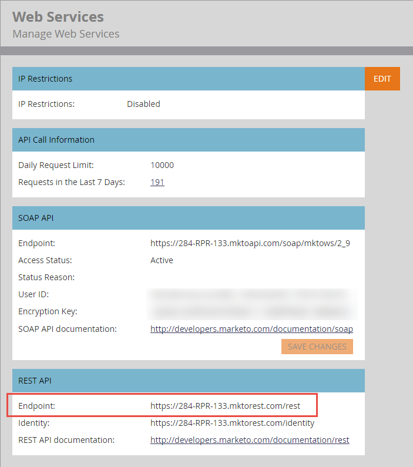

# Bas-URL

[Dokumentationen för ](endpoint-reference.md)-slutpunktsreferensen för varje API-anrop visar REST-metod, sökväg, resurs och parametrar som måste läggas till i bas-URL:en för att en begäran ska kunna skapas.

Följande är ett exempel på en korrekt formaterad REST-URL:

`https://284-RPR-133.mktorest.com/rest/v1/lead/318581.json?fields=email,firstName,lastName`

som består av följande delar:

- Bas-URL: `https://284-RPR-133.mktorest.com/rest`
- Sökväg: `/v1/lead/`
- Resurs: `318582.json`
- Frågeparameter: `fields=email,firstName,lastName`

Bas-URL:en innehåller konto-ID (även kallat Munchkin-ID) och är därför unik för varje Marketo-prenumeration. Du hittar din bas-URL genom att logga in på Marketo och navigera till menyn **[!UICONTROL Admin]** > **[!UICONTROL Integration]** > **[!UICONTROL Web Services]**. Det är märkt som &quot;Endpoint:&quot; under avsnittet &quot;REST API&quot; som i följande skärmbilder.

När du har hittat bas-URL:en kopierar du den och tar med den i URL:er som du använder när du anropar någon av REST API:erna.
