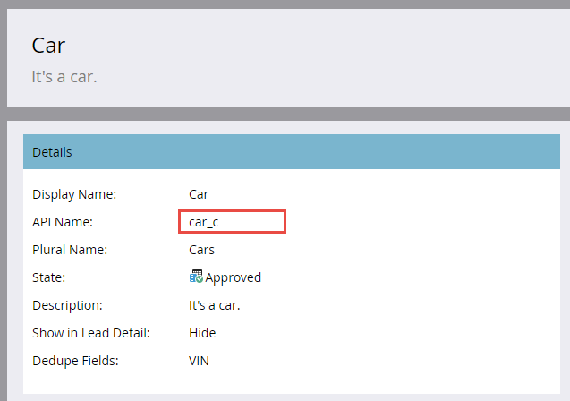

# Importera anpassat objekt gruppvis

[Slutpunktsreferens för gruppanpassad objektimport](https://developer.adobe.com/marketo-apis/api/mapi/#tag/Bulk-Import-Custom-Objects)

När du har många anpassade objektposter att importera är det bäst att importera dem asynkront med hjälp av bulk-API:t. Det gör du genom att importera en platt fil som innehåller avgränsade poster (komma, tabb eller semikolon). Filen kan innehålla valfritt antal poster, förutsatt att storleken är mindre än 10 MB (annars returneras en HTTP 413-statuskod). Innehållet i filen beror på din anpassade objektdefinition. Den första raden innehåller alltid en rubrik som visar de fält som värdena för varje rad ska mappas till. Alla fältnamn i huvudet måste matcha ett API-namn (vilket beskrivs nedan). Resterande rader innehåller de data som ska importeras, en post per rad. Poståtgärden är bara&quot;infoga eller uppdatera&quot;.

## Bearbetningsgränser

Du får skicka in mer än en bulkimportbegäran inom gränsen. Varje begäran läggs till som ett jobb i en FIFO-kö som ska bearbetas. Högst två jobb bearbetas samtidigt. Högst tio jobb tillåts i kön vid en given tidpunkt (inklusive de två som för närvarande bearbetas). Om du överskrider det maximala antalet tio jobb returneras felet &quot;1016, för många importer&quot;.

## Exempel på anpassat objekt

Innan du använder satsgränssnittet måste du använda användargränssnittet för Marketo Admin för att [skapa ett anpassat objekt](https://experienceleague.adobe.com/en/docs/marketo/using/product-docs/administration/marketo-custom-objects/create-marketo-custom-objects). Anta till exempel att vi har skapat ett anpassat bildobjekt med fälten &quot;Färg&quot;, &quot;Märke&quot;, &quot;Modell&quot; och &quot;VIN&quot;. Nedan visas gränssnittsskärmar för administratörer som visar det anpassade objektet. Du ser att vi har använt VIN-fältet för borttagning av dubbletter. API-namnen markeras eftersom de måste användas vid anrop av massrelaterade API-relaterade slutpunkter.



Här är de anpassade objektfälten som visas i administratörsgränssnittet.


### API-namn

Du kan hämta API-namn via programmering genom att skicka det anpassade objektets API-namn till [Beskriv anpassat objekt](#describe) slutpunkt.

```
/rest/v1/customobjects/{apiName}/describe.json
```

```json
{
    "requestId": "46ff#15a686e66de",
    "result": [
        {
            "name": "car_c",
            "displayName": "Car",
            "description": "It's a car.",
            "createdAt": "2017-02-22T19:55:51Z",
            "updatedAt": "2017-02-22T19:55:51Z",
            "idField": "marketoGUID",
            "dedupeFields": [
                "vin"
            ],
            "searchableFields": [
                [
                    "vin"
                ],
                [
                    "marketoGUID"
                ]
            ],
            "fields": [
                {
                    "name": "createdAt",
                    "displayName": "Created At",
                    "dataType": "datetime",
                    "updateable": false
                },
                {
                    "name": "marketoGUID",
                    "displayName": "Marketo GUID",
                    "dataType": "string",
                    "length": 36,
                    "updateable": false
                },
                {
                    "name": "updatedAt",
                    "displayName": "Updated At",
                    "dataType": "datetime",
                    "updateable": false
                },
                {
                    "name": "color",
                    "displayName": "Color",
                    "dataType": "string",
                    "length": 255,
                    "updateable": true
                },
                {
                    "name": "make",
                    "displayName": "Make",
                    "dataType": "string",
                    "length": 255,
                    "updateable": true
                },
                {
                    "name": "model",
                    "displayName": "Model",
                    "dataType": "string",
                    "length": 255,
                    "updateable": true
                },
                {
                    "name": "vin",
                    "displayName": "VIN",
                    "dataType": "string",
                    "length": 255,
                    "updateable": true
                }
            ]
        }
    ],
    "success": true
}
```

### Importera fil

Anta nu att du vill importera tre anpassade&quot;bildobjektsposter&quot;. Med kommaavgränsat format (CSV) kan filen se ut så här:

```
color,make,model,vin
red,bmw,2002,WBA4R7C55HK895912
yellow,bmw,320i,WBA4R7C30HK896061
blue,bmw,325i,WBS3U9C52HP970604
```

Rad 1 är rubriken, och raderna 2-4 är de anpassade objektdataposterna.

## Skapa ett jobb

Om du vill göra en begäran om massimport måste du inkludera det anpassade objektets API-namn i sökvägen till [Importera anpassade objekt](https://developer.adobe.com/marketo-apis/api/mapi/#tag/Identity/operation/identityUsingPOST) slutpunkt. Du måste också inkludera en file-parameter som refererar till namnet på importfilen och en format-parameter som anger hur importfilen avgränsas (&quot;csv&quot;, &quot;tsv&quot; eller &quot;ssv&quot;).

```
POST /bulk/v1/customobjects/{apiName}/import.json?format=csv
```

```
Transfer-Encoding: chunked
Content-Type: multipart/form-data; boundary=----WebKitFormBoundaryXjWP6BP8Ciq6bPeo
Content-Length: 290
Host: <munchkinId>.mktorest.com
```

```
------WebKitFormBoundaryXjWP6BP8Ciq6bPeo
Content-Disposition: form-data; name="file"; filename="custom_object_import.csv"
Content-Type: text/csv

color,make,model,vin
red,bmw,2002,WBA4R7C55HK895912
yellow,bmw,320i,WBA4R7C30HK896061
blue,bmw,325i,WBS3U9C52HP970604
------WebKitFormBoundaryXjWP6BP8Ciq6bPeo--
```

```json
{
    "requestId": "c015#15a68a23418",
    "result": [
        {
            "batchId": 1013,
            "status": "Queued",
            "objectApiName": "car_c"
        }
    ],
    "success": true
}
```

I det här exemplet angav vi formatet&quot;csv&quot; och gav importfilen namnet&quot;custom_object_import.csv&quot;.

Observera i svaret på vårt anrop att det inte finns någon lista över lyckade eller misslyckade åtgärder, som när du kom tillbaka från slutpunkten Synkronisera anpassade objekt. I stället får du en `batchId`. Detta beror på att anropet är asynkront och kan returnera en `status` av&quot;Köad&quot;,&quot;Importerar&quot; eller&quot;Misslyckades&quot;. Du bör behålla batchId så att du kan hämta status för importjobbet eller hämta fel och/eller varningar när det är klart. batchId är giltigt i sju dagar.

Ett enkelt sätt att replikera begäran om bulkimport är att använda url från kommandoraden:

```
curl -X POST -i -F format='csv' -F file='@custom_object_import.csv' -F access_token='<Access Token>' <REST API Endpoint URL>/bulk/v1/customobjects/car_c/import.json
```

Där importfilen &quot;custom_object_import.csv&quot; innehåller följande:

```
color,make,model,vin
red,bmw,2002,WBA4R7C55HK895912
yellow,bmw,320i,WBA4R7C30HK896061
blue,bmw,325i,WBS3U9C52HP970604
```

## Avsökningsjobbstatus

När importjobbet har skapats måste du kontrollera dess status. Det är bäst att avsöka importjobbet var 5-30:e sekund. Det gör du genom att skicka API-namnet för det anpassade objektet och `batchId` i sökvägen till [Hämta status för anpassat objekt för import](https://developer.adobe.com/marketo-apis/api/mapi/#tag/Bulk-Import-Custom-Objects/operation/getImportCustomObjectStatusUsingGET) slutpunkt.

```
GET /bulk/v1/customobjects/{apiName}/import/{batchId}/status.json
```

```json
{
    "requestId": "2a5#15a68dd9be1",
    "result": [
        {
            "batchId": 1013,
            "operation": "import",
            "status": "Complete",
            "objectApiName": "car_c",
            "numOfObjectsProcessed": 3,
            "numOfRowsFailed": 0,
            "numOfRowsWithWarning": 0,
            "importTime": "2 second(s)",
            "message": "Import succeeded, 3 records imported (3 members)"
        }
    ],
    "success": true
}
```

Det här svaret visar en slutförd import, men `status` kan vara något av: Slutförd, Köad, Importerad, Misslyckad. Om jobbet har slutförts finns en lista med antalet rader som har bearbetats, fel och varningar. Meddelandeattributet är också en bra plats att söka efter ytterligare jobbinformation på.

## Fel

Fel anges av `numOfRowsFailed` attribute in [Hämta status för anpassat objekt för import](https://developer.adobe.com/marketo-apis/api/mapi/#tag/Bulk-Import-Custom-Objects/operation/getImportCustomObjectStatusUsingGET) svar. Om numOfRowsFailed är större än noll visar det värdet antalet fel som uppstod. Utlysning [Fel vid import av anpassat objekt](https://developer.adobe.com/marketo-apis/api/mapi/#tag/Bulk-Import-Custom-Objects/operation/getImportCustomObjectFailuresUsingGET) slutpunkt för att hämta en fil med felinformation. Även här måste du skicka det anpassade objektets API-namn och `batchId` i banan. Om det inte finns någon felfil returneras en HTTP 404-statuskod.

Som fortsättning på exemplet kan vi tvinga fram ett misslyckande genom att ändra rubriken och ändra &quot;vin&quot; till &quot; vin&quot; (genom att lägga till ett blanksteg mellan kommatecknet och &quot;vin&quot;).

```
color,make,model, vin
```

När vi återimporterar och kontrollerar statusen ser vi det här svaret med `numRowsFailed`: 3. Detta indikerar tre fel.

```
GET /bulk/v1/customobjects/car_c/import/{batchId}/status.json
```

```json
{
    "requestId": "12260#15a68f491ed",
    "result": [
        {
            "batchId": 1016,
            "operation": "import",
            "status": "Complete",
            "objectApiName": "car_c",
            "numOfObjectsProcessed": 0,
            "numOfRowsFailed": 3,
            "numOfRowsWithWarning": 0,
            "importTime": "1 second(s)",
            "message": "Import completed with errors, 0 records imported (0 members), 3 failed"
        }
    ],
    "success": true
}
```

Nu gör vi ett anrop till slutpunkten Hämta fel för anpassat objekt för att få mer information om felet:

```
GET /bulk/v1/customobjects/car_c/import/{batchId}/failures.json
```

```
color,make,model, vin,Import Failure Reason
red,bmw,2002,WBA4R7C55HK895912,missing.dedupe.fields
yellow,bmw,320i,WBA4R7C30HK896061,missing.dedupe.fields
blue,bmw,325i,WBS3U9C52HP970604,missing.dedupe.fields
```

Och vi ser att vi missar vårt dedupliceringsfält `vin`.

## Varningar

Varningar indikeras av `numOfRowsWithWarning` i Get Import Custom Object Status response. Om numOfRowsWithWarning är större än noll visar det värdet antalet varningar som inträffade. Utlysning [Hämta varningar för anpassade objekt vid import](https://developer.adobe.com/marketo-apis/api/mapi/#tag/Bulk-Import-Custom-Objects/operation/getImportCustomObjectWarningsUsingGET) slutpunkt för att få en fil med varningsinformation. Även här måste du skicka det anpassade objektets API-namn och `batchId` i banan. Om det inte finns någon varningsfil returneras en HTTP 404-statuskod.

```
GET /bulk/v1/customobjects/car_c/import/{batchId}/warnings.json
```
