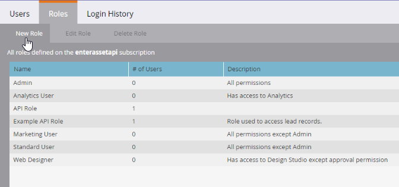

# Anpassade tjänster

En anpassad tjänst tillhandahåller autentiseringsuppgifter för autentisering med Marketo. Autentiseringsuppgifter krävs för att hämta en åtkomsttoken från Marketo [identitetstjänst](https://developer.adobe.com/marketo-apis/api/identity/#tag/Identity/operation/identityUsingGET). Varje anpassad tjänst omfattar en enda API-användare som den får sina behörigheter från.

## Roller

Det första steget i att skapa en anpassad tjänst är att skapa en roll som du kan tillämpa på den aktuella användaren med enbart API. Detta görs på menyn **[!UICONTROL Admin]** > **[!UICONTROL Users & Roles]** > **[!UICONTROL Roles]**.

Roller är behållare för individuella behörigheter som tillåter eller begränsar åtkomst till vissa funktioner. I prenumerationer där Arbetsytor och Partitioner är aktiverade tilldelas behörigheter per arbetsyta. Om en användare har en behörighet på en arbetsyta men inte en annan, kan de bara utföra tillåtna åtgärder på den arbetsytan. Om du vill skapa en roll klickar du på knappen Ny roll.

Ge din roll ett beskrivande namn. Användare med endast API har en specifik uppsättning behörigheter som är åtskilda från vanliga användarbehörigheter. API-behörigheter finns i deras egen hierarki under trädet Access API.

### Rollbehörigheter

Endast behörigheter i gruppen&quot;Access API&quot; tillämpas på API-användare, vilket innebär att alla administratörsbehörigheter inte ger några API-behörigheter till en användare.

När du skapar en roll bör du tänka noga på vilka åtgärder du bör tillåta att programmet som använder den gör. Beskriv endast de minimala behörigheter som krävs för att utföra dessa åtgärder. Om du tillåter en onödigt tillåten uppsättning behörigheter kan integreringar tillåta att utföra oönskade åtgärder i din prenumeration. Du kan använda [behörighetsverktyget](endpoint-reference.md) för att fastställa din minimala uppsättning behörigheter. Se den fullständiga listan över [behörigheter](#permission_list).

## Användare

När du har skapat en roll måste du skapa en användare med endast API. Användare med endast API är en speciell typ av användare i Marketo, eftersom de administreras av andra användare och inte kan användas för att logga in på Marketo. Användare med endast API kan:

- Skapa anpassade tjänster
- Omfattningsbehörigheter för dessa tjänster
- Åtkomst till REST API:er

>[!MORELIKETHIS]
>
>Om du vill skapa en användare med endast API går du till menyn **[!UICONTROL Admin]** > **[!UICONTROL Users & Roles]** > **[!UICONTROL Users]** och klickar på [!UICONTROL Invite New User].

Ge användaren ett beskrivande namn och en e-postadress (det måste inte vara giltigt) utifrån den tjänst och det program som det ska användas för. Fyll i de obligatoriska fälten i dialogrutan, klicka i kryssrutan Endast API och tilldela en av dina API-roller till användaren. Detta tilldelar rollens behörigheter till användaren.

Klicka slutligen på&quot;Skicka&quot; för att skapa användaren med endast API.

När du etablerar ett nytt program med autentiseringsuppgifter bör du överväga att skapa en ny användare för tjänsten även om den har samma behörighetsuppsättning som en annan befintlig integrering. Statistik och fel för användning av API-anrop spåras per användare, så om du etablerar en användare för varje program kan du isolera användning och problem i specifika program. Detta är praktiskt om du stöter på problem med att följa API-anropsgränserna eller fel som beror på API-anrop från integreringar.

## Anpassade tjänster

Anpassade tjänster tillhandahåller de faktiska autentiseringsuppgifter, klient-ID och klienthemlighet, som krävs för att utföra autentisering med en Marketo-instans. Om du vill etablera en sådan går du till menyn **[!UICONTROL Admin]** > **[!UICONTROL Integrations]** > **[!UICONTROL LaunchPoint]** och väljer **[!UICONTROL New Service]**.

Ge tjänsten ett beskrivande namn och välj Anpassad i listan Tjänst. Ge tjänsten en detaljerad beskrivning och välj en lämplig användare i listan Endast API-användare. Klicka sedan på [!UICONTROL Create].

Då läggs en ny tjänst till i listan över LaunchPoint-tjänster och alternativet &quot;Visa detaljer&quot;. Klicka på Visa detaljer så får du det klient-ID och den klienthemlighet som krävs för autentisering, den ägande användaren och ett alternativ för att hämta token för korttidstestning. Den token som du får från den här dialogrutan har samma livstid som tokens som hämtas normalt från [identitetstjänsten](https://developer.adobe.com/marketo-apis/api/identity/#tag/Identity/operation/identityUsingGET) och är giltig i 3 600 sekunder efter att den har skapats.

## Arbetsytor och partitioner

I prenumerationer med arbetsytor och partitioner ges möjlighet att komma åt en viss post eller resurs baserat på de behörigheter som en användares roll har på en viss arbetsyta. Varje arbetsyta får åtkomst till en eller flera partitioner på menyn Arbetsytor och partitioner, och ett lead tillhör en enda partition. Om användaren som bara har API har åtkomst till att läsa eller skriva lead-poster på en arbetsyta, kan den komma åt alla poster i partitioner som arbetsytan har åtkomst till.

Assets tillhör arbetsytor, så möjligheten att läsa eller skriva en resurs avgörs av om användaren har en roll på den relevanta arbetsytan som har behörighet att läsa eller skriva den resursposten på arbetsytan.

## Behörighetslista

Nedan följer en lista över alla behörigheter som är tillgängliga för användare med endast API och vad de tillåter en användare med den behörigheten att göra.

| Rollbehörighet | Bevilja åtkomst till.. |
| --- | --- |
| Godkänn Assets | Godkänn resurser |
| Kör kampanj | Begär eller schemalägg en kampanj |
| Skrivskyddad aktivitet | Hämta lead-aktiviteter |
| Metadata för skrivskyddad aktivitet | Hämta metadata för lead-aktivitet |
| Skrivskyddad Assets | Hämta tillgångsinformation |
| Skrivskyddad kampanj | Hämta kampanjinformation |
| Skrivskyddat företag | Hämta företagsinformation |
| Skrivskyddat anpassat objekt | Hämta information om anpassade objekt |
| Skrivskyddat lead | Hämta information om lead |
| Skrivskyddat namngivet konto | Hämta information om namngivet konto |
| Skrivskyddad lista över namngivna konton | Hämta information om namngiven kontolista |
| Skrivskyddad möjlighet | Hämta information om affärsmöjlighet |
| Skrivskyddad säljare | Hämta information om säljare |
| Aktivitet för läsning/skrivning | Hämta och skapa lead-aktiviteter |
| Metadata för aktiviteten Read-Write | Hämta och skapa metadata för lead-aktivitet |
| Read-Write Assets | Hämta, skapa och uppdatera resurser |
| Read-Write Campaign | Hämta, skapa och uppdatera kampanjer |
| Läs/skriv företag | Hämta, skapa och uppdatera företag |
| Anpassat objekt för läsning/skrivning | Hämta, skapa och uppdatera anpassade objekt |
| Läs/skriv lead | Hämta, skapa och uppdatera information om lead |
| Läs/skriv namngivet konto | Hämta, skapa och uppdatera namngivna konton |
| Läs/skriv namngiven kontolista | Hämta, skapa och uppdatera listor med namngivna konton |
| Möjligheter att läsa och skriva | Hämta, skapa och uppdatera affärsmöjligheter |
| Skrivskyddad säljare | Hämta, skapa och uppdatera säljare |
