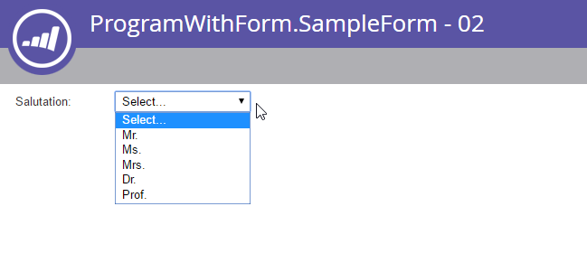

# Forms

[Forms-slutpunktsreferens](https://developer.adobe.com/marketo-apis/api/asset/#tag/Forms)

[Slutpunktsreferens för formulärfält](https://developer.adobe.com/marketo-apis/api/asset/#tag/Form-Fields)

Marketo-blanketter har en komplex uppsättning slutpunkter som ger fullständig kontroll över blanketthanteringen i fjärrsystem. Formulärstrukturen kan vara komplex eftersom det finns många olika typer av objekt som måste hanteras som en del av ett formulär: Forms, Fält, Fältuppsättningar, Synlighetsregler och Regler för uppföljningssidor.

## Fråga

Forms har stöd för standardmetoderna för hämtning av resurser, [by id](https://developer.adobe.com/marketo-apis/api/asset/#tag/Forms/operation/getLpFormByIdUsingGET), [by name](https://developer.adobe.com/marketo-apis/api/asset/#tag/Forms/operation/getLpFormByNameUsingGET) och [genom att bläddra](https://developer.adobe.com/marketo-apis/api/asset/#tag/Forms/operation/browseForms2UsingGET). Varje formulärsvar innehåller alla egenskaper förutom fältlistan.

### Efter ID

[Hämta formulär med ID](https://developer.adobe.com/marketo-apis/api/asset/#tag/Forms/operation/getLpFormByIdUsingGET) har formen `id` som en sökvägsparameter och returnerar en formulärpost.

```
GET /rest/asset/v1/form/{id}.json
```

```json
{
    "success": true,
    "warnings": [],
    "errors": [],
    "requestId": "948f#154e3bad8e3",
    "result": [
        {
            "id": 736,
            "name": "newForm",
            "description": "test",
            "createdAt": "2016-05-24T17:05:54Z+0000",
            "updatedAt": "2016-05-24T17:05:54Z+0000",
            "url": "https://app-devlocal1.marketo.com/#FO736B2",
            "status": "draft",
            "theme": "simple",
            "language": "French",
            "locale": "fr_FR",
            "progressiveProfiling": false,
            "labelPosition": "left",
            "fontFamily": "Helvetica",
            "fontSize": "13px",
            "folder": {
                "type": "Folder",
                "value": 293,
                "folderName": "yyLNLHzgOM"
            },
            "knownVisitor": {
                "type": "form",
                "template": null
            },
            "thankYouList": [
                {
                    "followupType": "none",
                    "followupValue": null,
                    "default": true
                }
            ],
            "buttonLocation": 120,
            "buttonLabel": "Envoyer",
            "waitingLabel": "Veuillez patienter"
        }
    ]
}
```

### Efter namn

[Get Form by Name](https://developer.adobe.com/marketo-apis/api/asset/#tag/Forms/operation/getLpFormByNameUsingGET) har formen `name` som en sökvägsparameter och returnerar en formulärpost.

```
GET /rest/asset/v1/form/byName.json?name=newForm
```

```json
{
    "success": true,
    "warnings": [],
    "errors": [],
    "requestId": "948f#154e3bad8e3",
    "result": [
        {
            "id": 736,
            "name": "newForm",
            "description": "test",
            "createdAt": "2016-05-24T17:05:54Z+0000",
            "updatedAt": "2016-05-24T17:05:54Z+0000",
            "url": "https://app-devlocal1.marketo.com/#FO736B2",
            "status": "draft",
            "theme": "simple",
            "language": "French",
            "locale": "fr_FR",
            "progressiveProfiling": false,
            "labelPosition": "left",
            "fontFamily": "Helvetica",
            "fontSize": "13px",
            "folder": {
                "type": "Folder",
                "value": 293,
                "folderName": "yyLNLHzgOM"
            },
            "knownVisitor": {
                "type": "form",
                "template": null
            },
            "thankYouList": [
                {
                    "followupType": "none",
                    "followupValue": null,
                    "default": true
                }
            ],
            "buttonLocation": 120,
            "buttonLabel": "Envoyer",
            "waitingLabel": "Veuillez patienter"
        }
    ]
}
```

### Bläddra

[Hämta Forms](https://developer.adobe.com/marketo-apis/api/asset/#tag/Forms/operation/browseForms2UsingGET)-formulär fungerar på samma sätt som andra bläddringsslutpunkter för resurs-API, och tillåter valfri filtrering på `status`, `maxReturn` och `offset`. Status kan vara: godkänd, godkänd med utkast eller utkast.

```
GET /rest/asset/v1/forms.json
```

```json
{
    "success": true,
    "warnings": [],
    "errors": [],
    "requestId": "645d#154e3d499ac",
    "result": [
        {
            "id": 227,
            "name": "aKAUVDfbsX",
            "description": "",
            "createdAt": "2016-05-18T20:36:20Z+0000",
            "updatedAt": "2016-05-18T20:36:20Z+0000",
            "url": "https://app-devlocal1.marketo.com/#FO227B2",
            "status": "draft",
            "theme": "simple",
            "language": "English",
            "locale": "en_US",
            "progressiveProfiling": false,
            "labelPosition": "left",
            "fontFamily": "Helvetica",
            "fontSize": "13px",
            "folder": {
                "type": "Folder",
                "value": 293,
                "folderName": "yyLNLHzgOM"
            },
            "knownVisitor": {
                "type": "form",
                "template": null
            },
            "thankYouList": [
                {
                    "followupType": "none",
                    "followupValue": null,
                    "default": true
                }
            ],
            "buttonLocation": 120,
            "buttonLabel": "Submit",
            "waitingLabel": "Please Wait"
        },
        {
            "id": 695,
            "name": "AoMXgfFbma",
            "description": "",
            "createdAt": "2016-05-19T18:50:40Z+0000",
            "updatedAt": "2016-05-19T18:50:40Z+0000",
            "url": "https://app-devlocal1.marketo.com/#FO695B2",
            "status": "draft",
            "theme": "simple",
            "language": "English",
            "locale": "en_US",
            "progressiveProfiling": true,
            "labelPosition": "left",
            "fontFamily": "Helvetica",
            "fontSize": "13px",
            "folder": {
                "type": "Folder",
                "value": 565,
                "folderName": "WfUvYmlcyT"
            },
            "knownVisitor": {
                "type": "form",
                "template": null
            },
            "thankYouList": [
                {
                    "followupType": "none",
                    "followupValue": null,
                    "default": true
                }
            ],
            "buttonLocation": 120,
            "buttonLabel": "Submit",
            "waitingLabel": "Please Wait"
        }
    ]
}
```

### Fältlista

Hämtningen av fältlistan för ett formulär görs per formulär.

```
GET /rest/asset/v1/form/{id}/fields.json
```

```json
{
    "success": true,
    "warnings": [],
    "errors": [],
    "requestId": "2165#154eee00d01",
    "result": [
        {
            "id": "FirstName",
            "label": "First Name:",
            "dataType": "text",
            "validationMessage": "This field is required.",
            "rowNumber": 0,
            "columnNumber": 0,
            "maxLength": 255,
            "required": false,
            "formPrefill": true,
            "visibilityRules": {
                "ruleType": "alwaysShow"
            }
        },
        {
            "id": "LastName",
            "label": "Last Name:",
            "dataType": "text",
            "validationMessage": "This field is required.",
            "rowNumber": 1,
            "columnNumber": 0,
            "maxLength": 255,
            "required": false,
            "formPrefill": true,
            "visibilityRules": {
                "ruleType": "alwaysShow"
            }
        },
        {
            "id": "Email",
            "label": "Email Address:",
            "dataType": "email",
            "validationMessage": "Must be valid email. <span class='mktoErrorDetail'>example@yourdomain.com</span>",
            "rowNumber": 2,
            "columnNumber": 0,
            "required": false,
            "formPrefill": true,
            "visibilityRules": {
                "ruleType": "alwaysShow"
            }
        },
        {
            "id": "Profiling",
            "dataType": "profiling",
            "rowNumber": 3,
            "columnNumber": 0
        }
    ]
}
```

När du redigerar fält, eller deras beteende i ett formulär, ska fältlistan alltid hämtas innan du försöker redigera. Detta garanterar att du ger rätt fält-ID när du uppdaterar eller tar bort.

### Fälttyper

| Gränssnittstyp | API Name |
|--------------|-----------------|
| Kryssrutor | kryssruta |
| Alternativknapp | radio |
| Textområde | textområde |
| Picklist | plocklista |
| Sträng | string |
| E-post | e-post |
| Datum | datum |
| Nummer | tal |
| Dubbel | double |
| Tel. | telefon |
| URL | url |
| Valuta | valuta |
| Kryssruta | single_checkbox |
| Skjutreglage | omfång |

### Beroenden

Slutpunkten [Hämta formulär som används av](https://developer.adobe.com/marketo-apis/api/asset/#tag/Forms/operation/getFormUsedByUsingGET) har formen `id` som sökvägsparameter och returnerar listan med resurser som är beroende av formuläret. Forms kan användas av följande resurstyper: landningssidor, smarta listor, smarta kampanjer, rapporter, e-postprogram.

```
GET /rest/asset/v1/form/{id}/usedBy.json
```

```json
{
    "success": true,
    "errors": [],
    "requestId": "fdf4#17285b25038",
    "warnings": [],
    "result": [
        {
            "id": 1038,
            "name": "LP Redirect Rules Program.LP Test 01",
            "type": "Landing Page",
            "status": "approved",
            "updatedAt": "2020-02-23T01:31:21Z+0000"
        }
    ]
}
```

## Skapa och uppdatera

När [skapar ett formulär](https://developer.adobe.com/marketo-apis/api/asset/#tag/Forms/operation/createLpFormsUsingPOST) finns det bara två obligatoriska fält: den överordnade mappen till formuläret, formulärets namn. Alla andra parametrar är valfria med standardvärdet. När formuläret skapas innehåller det tre standardfält: Förnamn, Efternamn, E-post.

```
POST /rest/asset/v1/forms.json
```

```
Content-Type: application/x-www-form-urlencoded
```

```
name=newForm&description=test&folder={"type": "Folder","id": 293}&language=French
```

```json
{
    "success": true,
    "warnings": [],
    "errors": [],
    "requestId": "948f#154e3bad8e3",
    "result": [
        {
            "id": 736,
            "name": "newForm",
            "description": "test",
            "createdAt": "2016-05-24T17:05:54Z+0000",
            "updatedAt": "2016-05-24T17:05:54Z+0000",
            "url": "https://app-devlocal1.marketo.com/#FO736B2",
            "status": "draft",
            "theme": "simple",
            "language": "French",
            "locale": "fr_FR",
            "progressiveProfiling": false,
            "labelPosition": "left",
            "fontFamily": "Helvetica",
            "fontSize": "13px",
            "folder": {
                "type": "Folder",
                "value": 293,
                "folderName": "yyLNLHzgOM"
            },
            "knownVisitor": {
                "type": "form",
                "template": null
            },
            "thankYouList": [
                {
                    "followupType": "none",
                    "followupValue": null,
                    "default": true
                }
            ],
            "buttonLocation": 120,
            "buttonLabel": "Envoyer",
            "waitingLabel": "Veuillez patienter"
        }
    ]
}
```

Forms [uppdateras](https://developer.adobe.com/marketo-apis/api/asset/#tag/Forms/operation/updateFormsUsingPOST) med ett liknande samtal via deras ID. När du skapar eller uppdaterar är valfri basformateringsparameter tillgänglig och redigerbar, vilket gör att du kan ändra hur formuläret visas för slutanvändaren.

```
POST /rest/asset/v1/form/736.json
```

```
Content-Type: application/x-www-form-urlencoded
```

```
name=updated name&description=This is a test for updateapi&language=English&progressiveProfiling=true&locale=en_US
```

```json
{
    "success": true,
    "warnings": [],
    "errors": [],
    "requestId": "6307#154e3cf6efe",
    "result": [
        {
            "id": 736,
            "name": "updated name",
            "description": "This is a test for update api",
            "createdAt": "2016-05-24T17:05:54Z+0000",
            "updatedAt": "2016-05-24T17:28:23Z+0000",
            "status": "draft",
            "theme": "simple",
            "language": "English",
            "locale": "en_US",
            "progressiveProfiling": true,
            "labelPosition": "left",
            "fontFamily": "Helvetica",
            "fontSize": "13px",
            "folder": {
                "type": "Folder",
                "value": 293,
                "folderName": "yyLNLHzgOM"
            },
            "knownVisitor": {
                "type": "form",
                "template": null
            },
            "thankYouList": [
                {
                    "followupType": "none",
                    "followupValue": null,
                    "default": true
                }
            ],
            "buttonLocation": 120,
            "buttonLabel": "Submit",
            "waitingLabel": "Please Wait"
        }
    ]
}
```

Sidbeteendena besökare och tack kan inte ändras via formuläranropen för att skapa eller uppdatera, och de måste nås via respektive slutpunkter.

## Fältmetadata

Om du vill lägga till eller redigera fält som tillhör ett formulär på rätt sätt måste du hämta listan över giltiga fält för målinstansen. Fältinteraktioner utförs alltid baserat på fältets id-egenskap, som visas för varje objekt i resultatet.

För Lead-fält görs detta med slutpunkten [Hämta tillgängliga formulärfält](https://developer.adobe.com/marketo-apis/api/asset/#tag/Form-Fields/operation/getAllFieldsUsingGET) och inkluderar datatypen och standardmetadata för fältet när det läggs till i ett formulär.

```
GET /rest/asset/v1/form/fields.json
```

```json
{
    "success": true,
    "errors": [],
    "requestId": "176ca#167a9808f4c",
    "warnings": [],
    "result": [
        {
            "id": "AnnualRevenue",
            "isRequired": false,
            "dataType": "currency"
        },
        {
            "id": "City",
            "isRequired": false,
            "dataType": "string",
            "maxLength": 255
        },
        {
            "id": "Company",
            "isRequired": false,
            "dataType": "string",
            "maxLength": 255
        },
        {
            "id": "Country",
            "isRequired": false,
            "dataType": "string",
            "maxLength": 255
        },
        {
            "id": "Description",
            "isRequired": false,
            "dataType": "textarea",
            "maxLength": 32000,
            "visibleRows": 2
        },
        {
            "id": "Email",
            "isRequired": false,
            "dataType": "email"
        },
        {
            "id": "Fax",
            "isRequired": false,
            "dataType": "phone"
        },
        {
            "id": "FirstName",
            "isRequired": false,
            "dataType": "string",
            "maxLength": 255
        },
        {
            "id": "Industry",
            "isRequired": false,
            "dataType": "string",
            "maxLength": 255
        },
        {
            "id": "LastName",
            "isRequired": false,
            "dataType": "string",
            "maxLength": 255
        },
        {
            "id": "LeadSource",
            "isRequired": false,
            "dataType": "string",
            "maxLength": 255
        },
        {
            "id": "MobilePhone",
            "isRequired": false,
            "dataType": "phone"
        },
        {
            "id": "NumberOfEmployees",
            "isRequired": false,
            "dataType": "int"
        },
        {
            "id": "Phone",
            "isRequired": false,
            "dataType": "phone"
        },
        {
            "id": "PostalCode",
            "isRequired": false,
            "dataType": "string",
            "maxLength": 255
        },
        {
            "id": "Rating",
            "isRequired": false,
            "dataType": "string",
            "maxLength": 255
        },
        {
            "id": "Salutation",
            "isRequired": false,
            "dataType": "picklist",
            "picklistValues": "Mr.,Ms.,Mrs.,Dr.,Prof."
        },
        {
            "id": "State",
            "isRequired": false,
            "dataType": "picklist",
            "picklistValues": "AK::AK,AL::AL,AR::AR,AZ::AZ,CA::CA,CO::CO,CT::CT,DE::DE,FL::FL,GA::GA,HI::HI,IA::IA,ID::ID,IL::IL,IN::IN,KS::KS,KY::KY,LA::LA,MA::MA,MD::MD,ME::ME,MI::MI,MN::MN,MO::MO,MS::MS,MT::MT,NC::NC,ND::ND,NE::NE,NH::NH,NJ::NJ,NM::NM,NV::NV,NY::NY,OH::OH,OK::OK,OR::OR,PA::PA,RI::RI,SC::SC,SD::SD,TN::TN,TX::TX,UT::UT,VA::VA,VT::VT,WA::WA,WI::WI,WV::WV,WY::WY"
        },
        {
            "id": "Street",
            "isRequired": false,
            "dataType": "textarea",
            "maxLength": 2000,
            "visibleRows": 2
        },
        {
            "id": "Title",
            "isRequired": false,
            "dataType": "picklist"
        }
    ]
}
```

Anropa [Hämta tillgängliga formulärprogrammedlemsfält](https://developer.adobe.com/marketo-apis/api/asset/#tag/Form-Fields/operation/getAllProgramMemberFieldsUsingGET) för anpassade fält för programmedlemmar.  slutpunkt för att hämta anpassade fältdatatyper och standardmetadata för programmedlemmar. Om du vill använda dessa fält i ett formulär måste formuläret finnas under ett program (inte i Design Studio). Landningssidor som innehåller formulär som använder dessa fält måste också ligga under ett program (kan inte finnas i Design Studio eller klonas i Design Studio).

```
GET /rest/asset/v1/form/programMemberFields.json
```

```json
{
    "success": true,
    "errors": [],
    "requestId": "109c6#16fa0b9c51a",
    "warnings": [],
    "result": [
        {
            "id": "pMCFCustomField01",
            "isRequired": false,
            "dataType": "string",
            "maxLength": 255
        },
        {
            "id": "pMCFCustomField02",
            "isRequired": false,
            "dataType": "string",
            "maxLength": 255
        },
        {
            "id": "myPMCF",
            "isRequired": false,
            "dataType": "string",
            "maxLength": 255
        }
    ]
}
```

### Redigera fält

Varje formulär innehåller en redigerbar lista med fält som visas för slutanvändaren när de läses in. Varje fält läggs till, uppdateras eller tas bort från fältlistan en åt gången via respektive slutpunkter.

[Om du lägger till ett fält](https://developer.adobe.com/marketo-apis/api/asset/#tag/Form-Fields/operation/addFieldToAFormUsingPOST) krävs bara ID:t för det överordnade formuläret och fieldId:t för fältet. Alla andra fält kommer antingen att vara tomma eller ha standardvärden som baseras på datatyp och fältmetadata. Data skickas som POST x-www-form-urlencoded, inte som JSON.

```
POST /rest/asset/v1/form/{id}/fields.json
```

```
Content-Type: application/x-www-form-urlencoded
```

```
fieldId=NumberOfEmployees&maxLength=125&defaultValue=this is default&required=true&fieldWidth=100&validationMessage=hey, you there?&label=employee count&hintText=Hint me&minValue=10
```

```json
{
    "success": true,
    "warnings": [],
    "errors": [],
    "requestId": "1826e#154f41b214c",
    "result": [
        {
            "id": "NumberOfEmployees",
            "label": "employee count",
            "fieldWidth": 100,
            "dataType": "number",
            "defaultValue": "this is default",
            "validationMessage": "hey, you there?",
            "rowNumber": 5,
            "columnNumber": 0,
            "required": true,
            "formPrefill": true,
            "fieldMetaData": {
                "minValue": 10,
                "maxValue": null
            },
            "visibilityRules": {
                "ruleType": "alwaysShow"
            },
            "hintText": "Hint me"
        }
    ]
}
```

Uppdateringarna kan redigera alla samma fält som att lägga till ett fält, och kräver också formulär-ID och fieldId, förutom att fieldId är en sökvägsparameter och inte en frågeparameter när uppdateringar utförs.

```
POST /rest/asset/v1/form/{id}/field/LastName.json
```

```
Content-Type: application/x-www-form-urlencoded
```

```
label=enter the last name here
```

```json
{
    "success": true,
    "warnings": [],
    "errors": [],
    "requestId": "5634#15508303abb",
    "result": [
        {
            "id": "LastName",
            "label": "enter the last name here",
            "dataType": "text",
            "validationMessage": "This field is required.",
            "rowNumber": 0,
            "columnNumber": 0,
            "maxLength": 255,
            "required": false,
            "formPrefill": true,
            "visibilityRules": {
                "ruleType": "alwaysShow"
            }
        }
    ]
}
```

I exemplet ovan uppdaterar vi fältet LastName som är en enkel sträng. Vissa formulärfält är mer komplexa. Fältet Hälsningsfras är till exempel en&quot;select&quot;-fälttyp som innehåller en lista med objekt och ett standardvärde. Om du lägger till eller uppdaterar ett markerat typfält, såvida du inte anger att ett av alternativen har värdet `isDefault` true, har det första alternativet inget värde och får etiketten&quot;Välj..&quot;.



För att uppdatera listobjekten är formatet för parametern &quot;values&quot; följande:

```
POST /rest/asset/v1/form/{id}/field/Salutation.json
```

```
Content-Type: application/x-www-form-urlencoded
```

```
values=[{"label":"Select...","value":"","isDefault":true,"selected":true}, {"label":"MR","value":"MR"}, {"label":"MS","value":"MS"}, {"label":"MRS","value":"MRS"}, {"label":"DR","value":"DR"}, {"label":"PROF","value":"PROF"}]
```

```json
{
  "success": true,
  "warnings": [ ],
  "errors": [ ],
  "requestId": "71fd#1588d9d1b0c",
  "result": [
    {
      "id": "Salutation",
      "label": "Salutation:",
      "dataType": "select",
      "validationMessage": "This field is required.",
      "rowNumber": 3,
      "columnNumber": 0,
      "required": false,
      "formPrefill": true,
      "fieldMetaData": {
        "multiSelect": false,
        "values": [
          {
            "label": "Select...",
            "value": "",
            "isDefault": true,
            "selected": true
          },
          {
            "label": "MR",
            "value": "MR"
          },
          {
            "label": "MS",
            "value": "MS"
          },
          {
            "label": "MRS",
            "value": "MRS"
          },
          {
            "label": "DR",
            "value": "DR"
          },
          {
            "label": "PROF",
            "value": "PROF"
          }
        ],
        "visibleLines": 1
      },
      "visibilityRules": {
        "ruleType": "alwaysShow"
      }
    }
  ]
}
```

Om du vill veta hur du formaterar ett komplext formulärfält kan du titta på svaret från Lägg till fält i formulär.

### Ordna om fält

Fält i ett formulär måste ordnas om som en enda enhet via slutpunkten [Ändra formulärfältspositioner](https://developer.adobe.com/marketo-apis/api/asset/#tag/Form-Fields/operation/updateFieldPositionsUsingPOST). Slutpunkten kräver en parameter med namnet `positions`, som är en JSON-array med objekt med tre medlemmar:

- columnNumber
- rowNumber
- fieldName (refererar till fältets id)

Fält i ett formulär ordnas i ett tabellliknande gränssnitt med upp till tre kolumner och upp till tio rader. Både rad och kolumn indexeras från 0, så den första raden och den första kolumnen indikeras genom att ange 0. Alla fält måste ha en unik position

Om målfältet också är en fältuppsättning, ska dess post i arrayen position också innehålla en parameter med namnet fieldList, en array med objekt som innehåller samma columnNumber-, rowNumber- och fieldName-medlemmar. Själva fältuppsättningen behandlas som ett enskilt fält för sin position i den överordnade listan, medan dess underfält placeras enligt de angivna positionerna i parametern fieldList.

```
POST /rest/asset/v1/form/{id}/reArrange.json
```

```
Content-Type: application/x-www-form-urlencoded
```

```
positions=[{"columnNumber":0,"rowNumber":0,"fieldName":"FirstName"},{"columnNumber":0,"rowNumber":1,"fieldName":"LastName"}, {"columnNumber":0,"rowNumber":2, "fieldName":"Email"}]
```

```json
{
    "success": true,
    "warnings": [],
    "errors": [],
    "requestId": "bb18#15508ef9c04",
    "result": [
        {
            "id": 764
        }
    ]
}
```

### RTF

RTF-fält läggs till via en [separat slutpunkt](https://developer.adobe.com/marketo-apis/api/asset/#tag/Form-Fields/operation/addRichTextFieldUsingPOST) från lead-fält. Fältinnehållet skickas som multipart/form-data. Det ska vara strukturerat som HTML-innehåll som inte innehåller några skript-, metataggar- eller länktaggar.

```
POST /rest/asset/v1/form/{id}/richText.json
```

```
Content-Type: multipart/form-data; boundary=---------------------------9051914041544843365972754266
-----------------------------9051914041544843365972754266
Content-Disposition: form-data; name="text"
Content-Type: text/html
<div>Fancy Rich Text Component</div>
-----------------------------9051914041544843365972754266--
```

```json
{
    "success": true,
    "warnings": [],
    "errors": [],
    "requestId": "82c8#154f423bf5c",
    "result": [
        {
            "id": "SHRtbFRleHRfMjAxNi0wNS0yN1QxNDozNDoyNC4xMTVa",
            "labelWidth": 260,
            "dataType": "htmltext",
            "rowNumber": 8,
            "columnNumber": 0,
            "visibilityRules": {
                "ruleType": "alwaysShow"
            },
            "text": "<div>Fancy Rich Text Component</div>"
        }
    ]
}
```

### Fieldset

Marketo-formulär har en valfri komponent som kallas fältuppsättningar. Fältuppsättningar är grupper av fält som behandlas som ett enda fält i den översta fältlistan för att kunna flyttas och behandlas enligt synlighetsregler. Om det till exempel finns ett fält för Krav på efterlevnad, och en klient väljer Ja, kan en fältuppsättning som innehåller fält för kompatibilitetskraven för HIPAA och PCI visas.

Fält i fältuppsättningar är unika för formuläret som helhet, så dubblettfält kanske inte finns både i formulärets överordnade fältlista och i en underordnad fältuppsättning. Fältuppsättningar läggs till via slutpunkten [Lägg till fältuppsättning i formulär](https://developer.adobe.com/marketo-apis/api/asset/#tag/Form-Fields/operation/addFieldSetUsingPOST) och visas sedan i resultatet [Hämta fält för formulär](https://developer.adobe.com/marketo-apis/api/asset/#tag/Form-Fields/operation/getFormFieldByFormVidUsingGET). Fält läggs till i en fältuppsättning genom att de flyttas till fältuppsättningens fieldList via [Uppdatera fältpositioner](https://developer.adobe.com/marketo-apis/api/asset/#tag/Form-Fields/operation/updateFieldPositionsUsingPOST). För dessa slutpunkter skickas data som POST x-www-form-urlencoded, inte som JSON.

## Synlighetsregel

Varje fält kan ha en uppsättning synlighetsregler som avgör om fältet kan ses av en besökare beroende på vilka värden som de har angett i formuläret. Reglerna gör en jämförelse mellan värdet för ett subjectField som finns i formuläret och en lista med värden som anges i regeln. Varje fält kan ha en typ av synlighetsregel, visa, dölja eller alltidVisa, och sedan en lista med regler som ska utvärderas. Reglerna utvärderas uppifrån och ned och den första regeln som utvärderas till true är den som kommer att användas.

Att ändra synlighetsregler är en destruktiv uppdatering.

```
POST /rest/asset/v1/form/{id}/field/Email/visibility.json
```

```
Content-Type: application/x-www-form-urlencoded
```

```
visibilityRule={"ruleType":"show", "rules":[{"subjectField": "LastName", "operator": "isNotEmpty", "values": [], "altLabel": "Email:"}]}
```

```json
{
    "success": true,
    "warnings": [],
    "errors": [],
    "requestId": "ab4a#15509030601",
    "result": [
        {
            "formFieldId": "Email",
            "ruleType": "show",
            "rules": [
                {
                    "subjectField": "LastName",
                    "operator": "isNotEmpty",
                    "values": [],
                    "altLabel": "Email:"
                }
            ]
        }
    ]
}
```

En fullständig lista över tillgängliga operatorer finns på slutpunktsreferenssidan för [Lägg till visningsregler för formulärfält](https://developer.adobe.com/marketo-apis/api/asset/#tag/Form-Fields/operation/addFormFieldVisibilityRuleUsingPOST).

## Uppföljning

Marketo-formulär kan ha en dynamisk uppföljningssidfunktion där regler för att omdirigera till en viss sida, eller behålla den aktuella sidan, kan tillämpas baserat på innehållet i angivna fält när de skickas. Regler kan kallas för Tack-sidan eller Regler för Uppföljningssida. Dessa regler representeras som en JSON-array med medlemmarna `followupType`, `followupValue`, `operator`, `subjectField`, `values` och `default`. `default` är ett booleskt värde där endast en post i arrayen kan vara sann. När en besökare inte kvalificerar sig för några andra regler, kommer den regel som angetts som standard att användas. `followupType` kan vara antingen lp eller url, där lp anger ett Marketo Landing Page-id för `followupValue` och url anger en URL till en annan sida. Operatorn används för att jämföra värdet i ämnesfältet med listan med värden som anges.

## Skicka-knapp

Formulärets Skicka-knappformat hanteras med slutpunkten [Uppdatera Skicka-knapp](https://developer.adobe.com/marketo-apis/api/asset/#tag/Forms/operation/updateFormSubmitButtonUsingPOST) . ButtonPosition, buttonStyle, label och waitingLabel (etiketten som visas när överföringen väntar) kan ändras.

Det här är en destruktiv uppdatering.

## Godkännande

Precis som de flesta andra resurser följer formulär en utkastsgodkänd modell, där det kan finnas ett utkast till version och/eller en godkänd version. När uppdateringarna tillämpas på ett formulär tillämpas de alltid först på utkastversionen och visas bara live när formuläret har godkänts. Godkännandet av ett formulär tar det aktuella utkastet till version och ersätter den godkända versionen, om en sådan finns, med utkastet. Om formuläret ska tas bort från live-versionen måste det först tas bort, vilket tar bort alla aktuella utkast, och den godkända versionen nedgraderas till ett utkastläge. Forms bör alltid tas bort innan du försöker ta bort.

## Progressiv profilering

När progressiv profilering är aktiverat för ett formulär, inkluderas en fältuppsättning med namnet &quot;Profiling&quot; i fältlistan. Om du vill lägga till eller ta bort fält från den progressiva profileringslistan måste du använda slutpunkten Uppdatera fältpositioner. Den här slutpunkten gör destruktiva uppdateringar, så alla fält i formuläret måste inkluderas i varje begäran. I exemplet nedan läggs fältet&quot;Telefon&quot; till i listan Progressiv profilering.

```
POST /rest/asset/v1/form/{id}/reArrange.json
```

```
Content-Type: application/x-www-form-urlencoded
```

```
positions=[{"columnNumber":0,"rowNumber":0,"fieldName":"Email"},{"columnNumber":0,"rowNumber":1,"fieldName":"LastName"},{"columnNumber":0,"rowNumber":2,"fieldName":"Company"},{"columnNumber":0,"rowNumber":3,"fieldName":"Website"},{"columnNumber":0,"rowNumber":4,"fieldName":"Profiling","fieldList":[{"columnNumber":0,"rowNumber":0,"fieldName":"Phone"}]}]
```

```json
{
    "success": true,
    "errors": [],
    "requestId": "3d6a#164190dbdf2",
    "result": [
        {
            "id": 1031
        }
    ]
}
```
