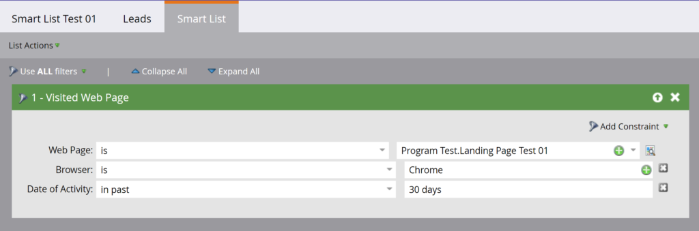

# Smarta listor

[Slutpunktsreferens för smarta listor](https://developer.adobe.com/marketo-apis/api/asset/#tag/Smart-Lists)

Marketo erbjuder en uppsättning REST API:er för att utföra åtgärder på smarta listor. Dessa API:er följer standardgränssnittsmönstret för resurs-API:er med alternativen Fråga, Ta bort och Klona.

Obs! Dessa API:er stöds endast för användarskapade smarta listor. De kan inte användas för [inbyggda/systemsmarta listor](https://experienceleague.adobe.com/en/docs/marketo/using/product-docs/core-marketo-concepts/smart-lists-and-static-lists/using-smart-lists/use-built-in-system-smart-lists).

## Fråga

När du frågar efter smarta listor används standardfrågetyperna för resurserna [via ID](https://developer.adobe.com/marketo-apis/api/asset/#tag/Smart-Lists/operation/getSmartListByIdUsingGET), [efter namn](https://developer.adobe.com/marketo-apis/api/asset/#tag/Smart-Lists/operation/getSmartListByNameUsingGET) och [bläddra](https://developer.adobe.com/marketo-apis/api/asset/#tag/Smart-Lists/operation/getSmartListsUsingGET).

### Efter ID

[Fråga efter ID](https://developer.adobe.com/marketo-apis/api/asset/#tag/Smart-Lists/operation/getSmartListByIdUsingGET) tar en enda smart lista `id` som sökvägsparameter och returnerar en enda smart listpost. Du kan också skicka den booleska parametern `includeRules` för att inkludera regler för smarta listor i svaret.



```
GET /rest/asset/v1/smartList/{id}.json?includeRules=true
```

```json
{
    "success": true,
    "errors": [],
    "requestId": "6efc#16c8967a21f",
    "warnings": [],
    "result": [
        {
            "id": 4363,
            "name": "Smart List Test 01",
            "createdAt": "2019-06-03T23:01:13Z+0000",
            "updatedAt": "2019-06-04T17:37:45Z+0000",
            "url": "https://app-sjqe.marketo.com/#SL4363A1LA1",
            "folder": {
                "id": 1041,
                "type": "Program"
            },
            "workspace": "Default",
            "rules": {
                "filterMatchType": "all",
                "triggers": [],
                "filters": [
                    {
                        "id": 459,
                        "name": "Visited Web Page",
                        "ruleTypeId": 1,
                        "ruleType": "Activity",
                        "operator": "occurs",
                        "conditions": [
                            {
                                "activityAttributeId": 1,
                                "activityAttributeName": "Web Page",
                                "operator": "is",
                                "values": [
                                    "Program Test.Landing Page Test 01"
                                ],
                                "isPrimary": true
                            },
                            {
                                "activityAttributeId": 6,
                                "activityAttributeName": "Browser",
                                "operator": "is",
                                "values": [
                                    "Chrome"
                                ],
                                "isPrimary": false
                            },
                            {
                                "activityAttributeId": -101,
                                "activityAttributeName": "Date of Activity",
                                "operator": "in past",
                                "values": [
                                    "30 days"
                                ],
                                "isPrimary": false
                            }
                        ]
                    }
                ]
            }
        }
    ]
}
```

### Efter smart kampanj-ID

[Fråga efter smart kampanj-ID](https://developer.adobe.com/marketo-apis/api/asset/#tag/Smart-Campaigns/operation/getSmartListBySmartCampaignIdUsingGET) tar en smart kampanj `id` som sökvägsparameter och returnerar en enda smart listpost. Du kan också skicka den booleska parametern `includeRules` för att inkludera regler för smarta listor i svaret.

```
GET /rest/asset/v1/smartCampaign/{smartCampaignId}/smartList.json
```

```json
{
    "success": true,
    "errors": [],
    "requestId": "6efc#16c8967a21f",
    "warnings": [],
    "result": [
        {
            "id": 4363,
            "name": "Smart List Test 01",
            "createdAt": "2019-06-03T23:01:13Z+0000",
            "updatedAt": "2019-06-04T17:37:45Z+0000",
            "url": "https://app-sjqe.marketo.com/#SL4363A1LA1",
            "folder": {
                "id": 1041,
                "type": "Program"
            },
            "workspace": "Default"
         }
    ]
}
```

### Per program-ID

[Fråga efter program-ID](https://developer.adobe.com/marketo-apis/api/asset/#tag/Programs/operation/getSmartListByProgramIdUsingGET) tar ett enskilt e-postprogram `id` som sökvägsparameter och returnerar en enda smart listpost. Du kan också skicka den booleska parametern `includeRules` för att inkludera regler för smarta listor i svaret.

```
GET /rest/asset/v1/program/{programId}/smartList.json
```

```json
{
    "success": true,
    "errors": [],
    "requestId": "6efc#16c8967a21f",
    "warnings": [],
    "result": [
        {
            "id": 4363,
            "name": "Smart List Test 01",
            "createdAt": "2019-06-03T23:01:13Z+0000",
            "updatedAt": "2019-06-04T17:37:45Z+0000",
            "url": "https://app-sjqe.marketo.com/#SL4363A1LA1",
            "folder": {
                "id": 1041,
                "type": "Program"
            },
            "workspace": "Default"
         }
    ]
}
```

### Efter namn

[Fråga efter namn](https://developer.adobe.com/marketo-apis/api/asset/#tag/Smart-Lists/operation/getSmartListByNameUsingGET) tar en smart lista `name` som parameter och returnerar en enda smart listpost.  En exakt strängmatchning utförs mot alla smarta listnamn i instansen och returnerar ett resultat för den smarta listan som matchar det namnet.

```
GET /rest/asset/v1/smartList/byName.json?name=2018 Leads
```

```json
{
    "success": true,
    "errors": [],
    "requestId": "115d7#16423bc13b4",
    "result": [
        {
            "id": 283988,
            "name": "2018 Leads",
            "createdAt": "2008-10-07T15:20:39Z+0000",
            "updatedAt": "2010-04-13T15:34:32Z+0000",
            "url": "https://app-abm.marketo.com/#SL283988A1",
            "folder": {
                "id": 31,
                "type": "Folder"
            },
            "workspace": "Default"
        }
    ]
}
```

### Bläddra

Smarta listor kan också [hämtas i grupper](https://developer.adobe.com/marketo-apis/api/asset/#tag/Smart-Lists/operation/getSmartListsUsingGET). Parametern `folder` används för att ange den överordnade mapp som frågan utförs i. Det är formaterat som ett JSON-objekt som innehåller `id` och `type`. Precis som andra slutpunkter för hämtning av gruppresurser är `offset` och `maxReturn` valfria parametrar som kan användas för sidindelning. De valfria parametrarna `earliestUpdatedAt` och `latestUpdatedAt` datetime kan användas för att filtrera resultaten efter datumintervallet UpdatedAt.

```
GET /rest/asset/v1/smartLists.json?folder={"id":31,"type":"Folder"}
```

```json
{
    "success": true,
    "errors": [],
    "requestId": "9aa4#16423c0e969",
    "result": [
        {
            "id": 283988,
            "name": "2018 Leads",
            "createdAt": "2008-10-07T15:20:39Z+0000",
            "updatedAt": "2010-04-13T15:34:32Z+0000",
            "url": "https://app-abm.marketo.com/#SL283988A1",
            "folder": {
                "id": 31,
                "type": "Folder"
            },
            "workspace": "Default"
        },
        {
            "id": 299697,
            "name": "Active Prospects",
            "createdAt": "2008-10-17T02:09:49Z+0000",
            "updatedAt": "2010-03-27T18:27:46Z+0000",
            "url": "https://app-abm.marketo.com/#SL299697A1",
            "folder": {
                "id": 31,
                "type": "Folder"
            },
            "workspace": "Default"
        },
        {
            "id": 400517,
            "name": "Leads by Score",
            "createdAt": "2009-01-07T18:52:52Z+0000",
            "updatedAt": "2010-04-13T15:36:09Z+0000",
            "url": "https://app-abm.marketo.com/#SL400517A1",
            "folder": {
                "id": 31,
                "type": "Folder"
            },
            "workspace": "Default"
        }
    ]
}
```

## Klona

[Kloning av en smart lista](https://developer.adobe.com/marketo-apis/api/asset/#tag/Smart-Lists/operation/cloneSmartListUsingPOST) utförs med en POST som kodats med application/x-www-form-urlencoded. Den smarta lista som ska klonas har angetts i sökvägsparametern `id`. Parametern `folder` används för att ange den överordnade mappen som den smarta listan ska skapas i och formateras som ett JSON-objekt som innehåller id och typ. Den överordnade mappen måste vara antingen en Program- eller en Smart List-mapp. Parametern `name` används för att namnge den nya smarta listan och måste vara unik. Parametern `description` kan också användas för att beskriva den smarta listan.

```
POST /rest/asset/v1/smartList/{id}/clone.json
```

```
Content-Type: application/x-www-form-urlencoded
```

```
folder={"id":31,"type":"Folder"}&name=2018 Leads Qualified
```

```json
{
    "success": true,
    "errors": [],
    "requestId": "a672#16423d755ed",
    "result": [
        {
            "id": 788645,
            "name": "2018 Leads Qualified",
            "createdAt": "2018-06-21T19:34:32Z+0000",
            "updatedAt": "2018-06-21T19:34:32Z+0000",
            "url": "https://app-abm.marketo.com/#SL788645A1",
            "folder": {
                "id": 31,
                "type": "Folder"
            },
            "workspace": "Default"
        }
    ]
}
```

## Ta bort

[Om du tar bort en smart lista ](https://developer.adobe.com/marketo-apis/api/asset/#tag/Smart-Lists/operation/deleteSmartListByIdUsingPOST) används en smart lista `id` som sökvägsparameter.

```
POST /rest/asset/v1/smartList/{id}/delete.json
```

```json
{
    "success": true,
    "errors": [],
    "requestId": "8f5#16423dd0fbe",
    "result": [
        {
            "id": 788645
        }
    ]
}
```
