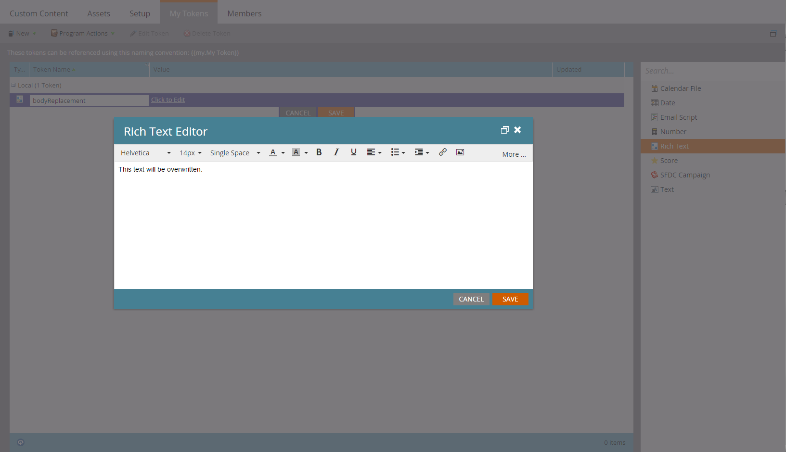

# Transaktionell e-post

Ett vanligt användningsexempel för Marketo API är att utlösa sändning av transaktionsmeddelanden till specifika poster via API-anropet [Request Campaign](https://developer.adobe.com/marketo-apis/api/mapi/#tag/Campaigns/operation/triggerCampaignUsingPOST) . Det finns några konfigurationskrav i Marketo för att köra det anrop som krävs med Marketo REST API.

- Mottagaren måste ha en post i Marketo
- Det måste finnas ett Transactional Email som skapats och godkänts i din Marketo-instans.
- Det måste finnas en aktiv utlösarkampanj med namnet&quot;Campaign is Requested, 1. Source: Web Service API&quot;, som är konfigurerat för att skicka e-post

[Skapa och godkänn din e-postadress](https://experienceleague.adobe.com/docs/marketo/using/home.html) först. Om e-postmeddelandet verkligen är transaktionellt måste du förmodligen ställa in det på operativ nivå, men se till att det lagligen klassificeras som operativt. Detta konfigureras från med redigeringsskärmen under E-poståtgärder > E-postinställningar:


Godkänn det så är vi redo att skapa vår kampanj:


Om du inte har skapat några kampanjer tidigare kan du läsa artikeln [Skapa en ny smart kampanj](https://experienceleague.adobe.com/docs/marketo/using/product-docs/core-marketo-concepts/smart-campaigns/creating-a-smart-campaign/create-a-new-smart-campaign.html) . När ni väl har skapat er kampanj måste vi gå igenom dessa steg. Konfigurera din smarta lista med kampanjutlösaren:


Nu måste vi konfigurera flödet så att det pekar ett Skicka e-post-steg mot vårt e-postmeddelande:


Innan aktiveringen görs måste du göra vissa inställningar på fliken Schema. Om det här e-postmeddelandet någonsin endast ska skickas en gång till en viss post låter du kvalificeringsinställningarna vara som de är. Men om det krävs att de får e-postmeddelandet flera gånger vill du justera det till antingen varje gång eller till någon av de tillgängliga caddenserna:

Nu kan vi aktivera:


## Skicka API-anrop

**Obs!** I Java-exemplen nedan använder vi paketet [minimum-json](https://github.com/ralfstx/minimal-json) för att hantera JSON-representationer i vår kod.

Den första delen av att skicka ett transaktionsmejl via API:t är att se till att det finns en post med motsvarande e-postadress i din Marketo-instans och att vi har tillgång till dess lead-ID. För det här inlägget antar vi att e-postadresserna redan finns i Marketo och att vi bara måste hämta postens ID. För detta använder vi anropet [Hämta leads efter filtertyp](https://developer.adobe.com/marketo-apis/api/mapi/#tag/Leads/operation/getLeadsByFilterUsingGET). Låt oss titta på vår huvudmetod för att begära kampanjen:

```java
package dev.marketo.blog_request_campaign;

import com.eclipsesource.json.JsonArray;

public class App
{
    public static void main( String[] args )
    {
        //Create an instance of Auth so that we can authenticate with our Marketo instance
        Leads leadsRequest = new Leads(auth).setFilterType("email").addFilterValue("requestCampaign.test@marketo.com");

        //Create and parameterize an instance of Leads
        //Set your email filterValue appropriately
        Leads leadsRequest = new Leads(auth).setFilterType("email").addFilterValue("test.requestCamapign@example.com");

        //Get the inner results array of the response
        JsonArray leadsResult = leadsRequest.getData().get("result").asArray();

        //Get the id of the record indexed at 0
        int lead = leadsResult.get(0).asObject().get("id").asInt();

        //Set the ID of your campaign from Marketo
        int campaignId = 0;
        RequestCampaign rc = new RequestCampaign(auth, campaignId).addLead(lead);

        //Send the request to Marketo
        rc.postData();
    }
}
```

För att få fram de här resultaten från JsonObject-svaret för leadsRequest måste vi skriva lite kod. För att kunna hämta det första resultatet i arrayen måste vi extrahera arrayen från JsonObject och få objektet indexerat på 0:

```java
JsonArray leadsResult = leadsRequest.getData().get("result").asArray();
int leadId = leadsResult.get(0).asObject().get("id").asInt();
```

Härifrån behöver vi bara ringa Request Campaign. För detta krävs ID i URL:en för begäran och en array med JSON-objekt som innehåller en medlem, &quot;id&quot;. Låt oss titta på koden för detta:

```java
package dev.marketo.blog_request_campaign;
import java.io.IOException;
import java.io.InputStream;
import java.io.InputStreamReader;
import java.io.OutputStreamWriter;
import java.io.Reader;
import java.net.MalformedURLException;
import java.net.URL;
import java.util.ArrayList;
import javax.net.ssl.HttpsURLConnection;
import com.eclipsesource.json.JsonArray;
import com.eclipsesource.json.JsonObject;

public class RequestCampaign {
    private String endpoint;
    private Auth auth;
    public ArrayList leads = new ArrayList();
    public ArrayList tokens = new ArrayList();

    public RequestCampaign(Auth auth, int campaignId) {
        this.auth = auth;
        this.endpoint = this.auth.marketoInstance + "/rest/v1/campaigns/" + campaignId + "/trigger.json";
    }
    public RequestCampaign setLeads(ArrayList leads) {
        this.leads = leads;
        return this;
    }
    public RequestCampaign addLead(int lead){
        leads.add(lead);
        return this;
    }
    public RequestCampaign setTokens(ArrayList tokens) {
        this.tokens = tokens;
        return this;
    }
    public RequestCampaign addToken(String tokenKey, String val){
        JsonObject jo = new JsonObject().add("name", tokenKey);
        jo.add("value", val);
        tokens.add(jo);
        return this;
    }
    public JsonObject postData(){
        JsonObject result = null;
        try {
            JsonObject requestBody = buildRequest(); //builds the Json Request Body
            System.out.println("Executing RequestCampaign call\n" + "Endpoint: " + endpoint + "\nRequest Body:\n"  + requestBody);
            URL url = new URL(endpoint);
            HttpsURLConnection urlConn = (HttpsURLConnection) url.openConnection(); //Return a URL connection and cast to HttpsURLConnection
            urlConn.setRequestMethod("POST");
            urlConn.setRequestProperty("Content-type", "application/json");
            urlConn.setRequestProperty("accept", "text/json");
            urlConn.setDoOutput(true);
            OutputStreamWriter wr = new OutputStreamWriter(urlConn.getOutputStream());
            wr.write(requestBody.toString());
            wr.flush();
            InputStream inStream = urlConn.getInputStream(); //get the inputStream from the URL connection
            Reader reader = new InputStreamReader(inStream);
            result = JsonObject.readFrom(reader); //Read from the stream into a JsonObject
            System.out.println("Result:\n" + result);
        } catch (MalformedURLException e) {
            e.printStackTrace();
        } catch (IOException e) {
            e.printStackTrace();
        }
        return result;
    }

    private JsonObject buildRequest(){
        JsonObject requestBody = new JsonObject(); //Create a new JsonObject for the Request Body
        JsonObject input = new JsonObject();
        JsonArray leadsArray = new JsonArray();
        for (int lead : leads) {
            JsonObject jo = new JsonObject().add("id", lead);
            leadsArray.add(jo);
        }
        input.add("leads", leadsArray);
        JsonArray tokensArray = new JsonArray();
        for (JsonObject jo : tokens) {
            tokensArray.add(jo);
        }
        input.add("tokens", tokensArray);
        requestBody.add("input", input);
        return requestBody;
    }

}
```

Den här klassen har en konstruktor som tar en Auth och kampanjens ID. Leads läggs till i objektet antingen genom att skicka en `ArrayList<Integer>` som innehåller ID:n för posterna till setLeads, eller genom att använda addLead, som tar ett heltal och lägger till den till den befintliga ArrayList i egenskapen leads. För att API-anropet ska kunna skicka lead-posterna till kampanjen måste postData anropas, vilket returnerar ett JsonObject som innehåller svarsdata från begäran. När en begärandekampanj anropas bearbetas varje lead som skickas till anropet av målutlösarkampanjen i Marketo och skickas det e-postmeddelande som skapades tidigare. Du har utlöst ett e-postmeddelande via Marketo REST API. Håll ett öga på del 2 där vi tittar på hur vi dynamiskt anpassar innehållet i ett e-postmeddelande med hjälp av Request Campaign.

### Bygger din e-postadress

För att kunna anpassa innehållet måste vi först konfigurera ett [program](https://experienceleague.adobe.com/docs/marketo/using/product-docs/core-marketo-concepts/programs/creating-programs/create-a-program.html) och ett [e-postmeddelande](https://experienceleague.adobe.com/docs/marketo/using/home.html) i Marketo. För att kunna generera vårt anpassade innehåll måste vi skapa variabler i programmet och sedan placera dem i det e-postmeddelande som vi ska skicka. För enkelhetens skull använder vi bara en token i det här exemplet, men du kan ersätta ett valfritt antal token i ett e-postmeddelande, i Från e-post, Från namn, Svar till eller valfritt innehåll i e-postmeddelandet. Låt oss skapa en variabel med formaterad text för ersättning och kalla den för&quot;bodyReplacement&quot;. Med RTF kan vi ersätta innehåll i token med godtycklig HTML som vi vill mata in.



Token kan inte sparas när den är tom, så infoga lite platshållartext här. Nu måste vi infoga vår token i e-postmeddelandet:


Denna token kommer nu att vara tillgänglig för ersättning via ett Request Campaign-samtal. Den här variabeln kan vara så enkel som en enda textrad som måste ersättas per e-post, eller kan innehålla nästan hela layouten för e-postmeddelandet.

### Koden

```java
package dev.marketo.blog_request_campaign;

import com.eclipsesource.json.JsonArray;

public class App
{
    public static void main( String[] args )
    {
        //Create an instance of Auth so that we can authenticate with our Marketo instance
        Auth auth = new Auth("Client ID - CHANGE ME", "Client Secret - CHANGE ME", "Host - CHANGE ME");

        //Create and parameterize an instance of Leads
        Leads leadsRequest = new Leads(auth).setFilterType("email").addFilterValue("requestCampaign.test@marketo.com");

        //get the inner results array of the response
        JsonArray leadsResult = leadsRequest.getData().get("result").asArray();

        //get the id of the record indexed at 0
        int lead = leadsResult.get(0).asObject().get("id").asInt();

        //Set the ID of our campaign from Marketo
        int campaignId = 1578;
        RequestCampaign rc = new RequestCampaign(auth, campaignId).addLead(lead);

        //Create the content of the token here, and add it to the request
        String bodyReplacement = "<div class=\"replacedContent\"><p>This content has been replaced</p></div>";
        rc.addToken("{{my.bodyReplacement}}", bodyReplacement);
        rc.postData();
    }
}
```

Om koden ser bekant ut beror det på att den bara har två rader från huvudmetoden ovan. Den här gången skapar vi innehållet i vår token i variabeln bodyReplacement och använder sedan metoden addToken för att lägga till den i begäran. addToken tar en nyckel och ett värde och skapar sedan en JsonObject-representation och lägger till den i den interna tokens-arrayen. Detta serialiseras sedan under metoden postData och skapar en brödtext som ser ut så här:

```json
{
    "input":
    {
        "leads": [
            {
                "id": 1
            }
        ],
        "tokens": [
            {
                "name": "{{my.bodyReplacement}}",
                "value": "<div class=\"replacedContent\"><p>This content has been replaced</p></div>"
            }
        ]
    }
}
```

Tillsammans ser konsolutdata ut så här:

```bash
Token is empty or expired. Trying new authentication
Trying to authenticate with ...
Got Authentication Response: {"access_token":"19d51b9a-ff60-4222-bbd5-be8b206f1d40:st","token_type":"bearer","expires_in":3565,"scope":"apiuser@mktosupport.com"}
Executing RequestCampaign call
Endpoint: .../rest/v1/campaigns/1578/trigger.json
Request Body:
{"input":{"leads":[{"id":1}],"tokens":[{"name":"{{my.bodyReplacement}}","value":"<div class=\"replacedContent\"><p>This content has been replaced</p></div>"}]}}
Result:
{"requestId":"1e8d#14eadc5143d","result":[{"id":1578}],"success":true}
```

## Radbrytning

Den här metoden är utökningsbar på många olika sätt, och ändrar innehåll i e-postmeddelanden inom enskilda layoutavsnitt eller externa e-postmeddelanden, så att anpassade värden kan skickas till uppgifter eller intressanta ögonblick. Du kan anpassa varifrån som helst en token kan användas från i ett program med den här metoden. Liknande funktioner är också tillgängliga med anropet [Schemalägg kampanj](https://developer.adobe.com/marketo-apis/api/mapi/#tag/Campaigns/operation/scheduleCampaignUsingPOST) som gör att du kan bearbeta tokens i en hel gruppkampanj. Dessa kan inte anpassas per lead, men är användbara för att anpassa innehåll för en mängd leads.
