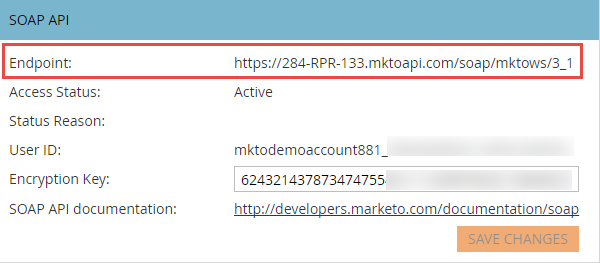

# SOAP API

SOAP-API:t har tagits bort och kommer inte längre att vara tillgängligt efter den 31 oktober 2025. All ny utveckling ska utföras med Marketo [REST API](../rest-api/rest-api.md) och befintliga tjänster ska migreras före detta datum för att undvika avbrott i tjänsten. Om du har en tjänst som använder SOAP API kan du läsa SOAP API [Migreringshandbok](./migration.md) för information om hur du migrerar.

## SOAP WSDL

Hämta SOAP API-slutpunkten från menyn **[!UICONTROL Admin]** > **[!UICONTROL Integration]** > **[!UICONTROL Web Services]** om du vill hämta SOAP WSDL-dokumentet.

WSDL-URL:

`<SOAP API Endpoint> + ?WSDL`

Använd inte slutpunkten som definieras i WSDL. Varje Marketo-instans har en unik slutpunkt där anrop ska göras.

## Gränser

- **Daglig kvot:** De flesta prenumerationer tilldelas 10 000 API-anrop per dag (som återställs dagligen med 12:00AM CST). Du kan öka din dagliga kvot med din kontohanterare.
- **Hastighetsgräns:** API-åtkomst per instans begränsad till 100 anrop per 20 sekunder.
- **Samtidighetsgräns:**  Max tio samtidiga API-anrop.

Vi rekommenderar att gruppstorlekarna inte är större än 300. Större storlekar stöds inte och kan resultera i timeout och i extrema fall strypas.

## SOAP API-inställningar i Marketo

1. Gå till avsnittet **[!UICONTROL Admin]** och klicka på **[!UICONTROL Web Services]**.

1. Ange ett lämpligt [!UICONTROL Encryption Key], klicka på **[!UICONTROL Save Changes]** och använd SOAP API [!UICONTROL Endpoint] -, [!UICONTROL User ID] - och [!UICONTROL Encryption Key] -värden för att generera rätt [autentiseringssignatur](authentication-signature.md) för varje SOAP API-anrop.

