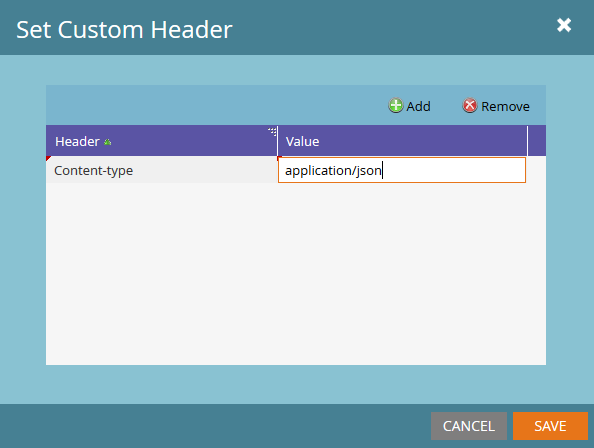

# Webhooks

Marketo tillåter att webbhooks används för att kommunicera med tredjepartstjänster. Webhooks stöder användningen av GET eller POST HTTP-verb för att skicka eller hämta data från en viss URL. Detaljerade instruktioner om hur du skapar webbböcker i programmet och hur du lägger till dem i smarta kampanjer finns i följande artiklar:

- [Skapa en webkrok](https://experienceleague.adobe.com/en/docs/marketo/using/product-docs/administration/additional-integrations/create-a-webhook)
- [Anropa webkrok](https://experienceleague.adobe.com/en/docs/marketo/using/product-docs/core-marketo-concepts/smart-campaigns/flow-actions/call-webhook)
- [Använd en webkrok i en smart kampanj](https://experienceleague.adobe.com/en/docs/marketo/using/product-docs/core-marketo-concepts/smart-campaigns/flow-actions/use-a-webhook-in-a-smart-campaign)

Varje enskild webkrok har följande egenskaper:

- [!UICONTROL URL] - Ange den URL som du använder för att skicka din begäran till webbtjänsten.
- [!UICONTROL Request Type] - HTTP-metoden.
- [!UICONTROL Payload Template] - Om du vill överföra information i POST-brödtexten anger du mallen. Använd valfritt dataformat som stöder HTTP POST, inklusive XML, JSON eller SOAP. Serialiseringsformatet måste tillåta dubbla citattecken runt strängar. Om du vill infoga en token i mallen klickar du på **[!UICONTROL Insert Token]**.  Token av strängtyp omsluts automatiskt av dubbla citattecken.
- [!UICONTROL Request Token Encoding] - Om tokenvärdena innehåller specialtecken (t.ex. ett et-tecken (&amp;)) anger du formatet för din begäran (JSON eller Form/Url). Korrekt kodning bör väljas för brödtexten för att säkerställa att Webkroken kommunicerar korrekt med webbtjänsten.
- [!UICONTROL Response Type] - Välj formatet för det svar som du får från tjänsten (JSON eller XML). Du måste välja rätt svarstyp för att mappa egenskaper för svaret tillbaka till lead-fält i Marketo
- [!UICONTROL Custom Headers] - Den här menyn används via [!UICONTROL Webhooks Actions] -> [!UICONTROL Set Custom Header] och tillåter att valfritt antal anpassade nyckelvärdepar läggs till som HTTP-huvuden.

Data kan skrivas tillbaka till leads från webbtjänstsvar med [svarsmappningar](response-mappings.md)

## Tokens

Alla utgående fält i en webkrok (URL, Mall och Anpassade rubriker) fyller i innehållet i tokens i samma sammanhang som flödessteget. Detta innebär att lead- och systemtokens alltid är tillgängliga, medan utlösare, kampanj- och programtokens är tillgängliga i sina respektive omfång. Se tokenrelaterade artiklar:

- [Översikt över token](https://experienceleague.adobe.com/en/docs/marketo/using/product-docs/demand-generation/landing-pages/personalizing-landing-pages/tokens-overview)
- [Ordlista för systemtoken](https://experienceleague.adobe.com/en/docs/marketo/using/product-docs/email-marketing/general/using-tokens/system-tokens-glossary)
- [Tokens för intressanta ögonblick](https://experienceleague.adobe.com/en/docs/marketo/using/product-docs/marketo-sales-insight/msi-for-salesforce/features/tabs-in-the-msi-panel/interesting-moments/trigger-tokens-for-interesting-moments)

Ett vanligt fall för detta är när ett program eller en kampanj uttryckligen mappas till en tredjepartsresurs. Ett ID kan anges på programnivå som `My Token` och sedan skickas till Webkrok-begäran som en token.

## Anpassade rubriker

På webbhooks kan valfritt antal anpassade rubrikfält skickas tillsammans med den utgående begäran. Dessa kan läggas till via **[!UICONTROL Webhooks Actions]** > **[!UICONTROL Set Custom Header]**. Varje rubrik registreras som ett enkelt nyckelvärdepar. Token kan användas i det här området.

## Tips

- Flödessteget Anropa webkrok är endast giltigt i utlösarkampanjer.
- Uppdateringar via svarsmappningar görs endast om webbtjänsten svarar med en 2xx HTTP-svarskod. Andra typer av koder leder inte till att posten uppdateras.
- Du kan använda webbtjänster för att utföra anpassad datanrikning, validering eller normalisering från interna eller externa tjänster.
- Körningstiden för webkrok är en förutsättning för svarstiden för den tjänst som används och kan leda till långa förseningar i kampanjutförandet. Även om det bara tar 50 ms att utföra en tjänst är det 1,5 timmar när den körs 100 000 gånger.
- Marketo väntar i upp till 30 sekunder på ett givet servicesamtal innan samtalet avslutas (alias timeout).
- Tecken som är inbäddade i URL-fältet skickas som skrivna, t.ex. &#39;&amp;&#39; skickas som &#39;&amp;&#39;, &#39;%26&#39; skickas som &#39;%26&#39;
   - Om ett tecken ska vara procentkodat när det tas emot av mottagarservern, ska det skickas explicit som strängen som representerar det tecknet
